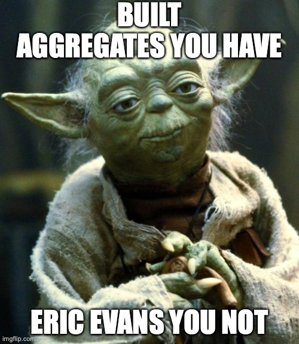

# How to progress

<figure><figcaption>
I had to make this and now there is no turning back.
</figcaption></figure>

You made it this far, good for you! I'll take the opportunity to describe a number of things you can do to learn more.

If you are anything like me, or most people I suppose, then it's going to take more than one activity and one shot at a project to make it have all the bells and whistles. My proposal is to continue doing hands-on work based on what you've seen. It should be able to sustain you for some time. Then, as you have something of your own in your backpack, you can start to truly take in the full extent of DDD and what has been said and thought.

## Practice the craft

### Run the demo code locally

I wouldn't be surprised if you "only" read the book. Not an issue!

But do take the time to actually run the code locally and muck about with it to see things change and evolve as you interact with the source code. You might be inexperienced with TypeScript or JavaScript, or any of the other many pieces that make it run, but there just is no way to better understand tactical DDD. Since you already have the heavy lifting done for you, go ahead and feel like a princess and play with it (before burning it down).

### Add support for multiple rooms, sites, time zones

Using the reference project, you could start adapting for new requirements, like being able to have multiple rooms and/or sites and/or time zones. Or anything else for that matter.

Identify what changes would be needed, if you need new aggregates (or an aggregate root) or entities etc. It should be possible to evolve such functionality without significant rework.

### Build the application from scratch

You could certainly take the starting requirements and build the application to the best of your abilities in your language/runtime and other technologies of choosing.

### Build your own application

Why not just go all the way and do what I did (minus writing a book) and build an application based on your own requirements.

Make sure that you keep level-headed and objective and that you try to keep the phases clean — first the high level scenario to guide the project, then conducting the strategic DDD, and only after that proceeding to the tactical implementation work. You may of course iterate the cycles, but you'll have to role play a "business owner" type character while starting, unless you want it to possibly derail into being any old pet project.


A spin on this is to actually do a real (low-key) project, maybe for some friends or family, or some affiliation you are part of.


## Learn to communicate better

### Learn diagramming

Diagramming is a core skill of senior engineers and most architects. They allow, when they are good, an easy-to-digest and precise format. As an author, I find that it's often more accurate than text and faster to finish than writing, too.

The sad truth is that many diagrams that I've seen are miserable because of some combination of (for example):

* Mixed views in the same diagram
* Confusing, overall
* Inconsistent style
* Aesthetically displeasing

While these are just some of the many parameters that could go wrong, **the **_**most pressing**_** problem is that many times you are happy to have a diagram at all, in the first place**.

So: Diagram everything and make others do it too.

If you've been around the block, you might wonder "Should I just learn UML?". It's a rich and formal way of diagramming, but to be frank, few are orthodox about it. Most will learn the basics and then stay happy with what they took to heart, ergo, not all of it. But if you _do_ want to go full UML, there's the GitHub repo for [_Learn UML2.\* in simple terms_](https://github.com/imalitavakoli/learn-uml2). On the book side, the classic book on the subject is Martin Fowler's [_UML Distilled_](https://martinfowler.com/books/uml.html).

Lucidchart is a commercial tool that you may or may not want to use. They do however offer a [wide range of tutorials for how to work with many types of diagrams](https://www.lucidchart.com/pages/tour). It's a good start.

For software tools, you might want to consider:

* [Lucidchart](https://lucid.co)
* [Whimsical](https://whimsical.com)
* [Figma](https://www.figma.com), which has the [FigJam](https://www.figma.com/figjam/) online whiteboard feature; [more on diagramming here](https://www.figma.com/learn-diagramming/what-is-diagramming/)
* [Excalidraw](https://excalidraw.com)
* [Diagrams.net](https://www.diagrams.net) (previously Draw.io)
* [Miro](https://miro.com)


My personal picks are Excalidraw for online collaborative whiteboarding and Diagrams.net for professional work that I can predominantly work on solo and then share as a file asset.

Diagrams.net works perfectly fine for both UML-style diagrams and your typical free-form diagrams.


### Write technical documentation

Write. Either for an own project, something at work, an open source project, or whatever really. Just write. We all learn it in school, but—and I know I am hard here—an engineer or architect who cannot write or communicate efficiently is not worth their salt. Sad to say, but that quality is not something I experience a lot...

Different languages have different standards or mannerisms. For our project, we used [JSDoc](https://jsdoc.app) with a light stylistic mannerism to not re-document anything that's obvious in the TypeScript types. For example, in the case of .NET you might want to look at [DocFX](https://docs.microsoft.com/en-us/shows/on-net/intro-to-docfx).

One of my favorite, and quite extensive, articles on technical writing is InnoQ's [_Principles of technical documentation_](https://www.innoq.com/en/articles/2022/01/principles-of-technical-documentation/).

Obviously technical writing is vital for tech companies. Google has [published several courses](https://developers.google.com/tech-writing/overview) you can take, as has GitLab, [_Technical Writing Fundamentals_](https://about.gitlab.com/handbook/engineering/ux/technical-writing/fundamentals/).

For an interesting approach to technical writing, you should check out [Diátaxis](https://diataxis.fr).


It would be strange to not be able to identify "good docs when you see them". For some examples of good writing, see:

* [Mozilla Developer Network Web Docs](https://developer.mozilla.org/en-US/docs/Learn)
* [Cloudflare Docs](https://developers.cloudflare.com)
* [Kubernetes Documentation](https://kubernetes.io/docs/home/)
* [Google Cloud documentation](https://cloud.google.com/docs)


### Push for a "ubiquitous language" in an existing project

As long as we have a business/tech split in a project or organization, whatever side you are on will always be easier to work with—if you are a techie, you could start using the tactical patterns right now. But what good will it make, beyond maybe just being a more disciplined refactoring of whatever code you already have?&#x20;

That's why I think you should spend time building the circumstances to enable effective collaboration between the most important groups, so that you can actually create the core semantic artifacts and have these in a documented format.

Starting where you are _now_ should makes this less scary, and you probably already have an idea of what's going on around you.

### Try out EventStorming with colleagues or friends

With the ubiquitous language defined, perhaps it's time to scale up and go for the full monty? In that case EventStorming could be an option. The ideas are easy enough, and as always, good facilitation might be the biggest requirement that's not listed upfront.

Either ask someone who has done this before, or accept that we all learn by doing and **just do it**. The book is cheap, you can always [learn-by-video](https://www.youtube.com/watch?v=mLXQIYEwK24), and there are plenty of good articles describing how to run a workshop.

## Know your sh\*t

### Read up on secondary-source literature

There's excellent and more condensed material available these days than in the days of yore. It doesn't replace the original texts as much as it offers a more accessible path for many readers.

I recommend Vladik Khononov's [_Learning Domain-Driven Design: Aligning Software Architecture and Business Strategy_](https://www.goodreads.com/en/book/show/57573212-learning-domain-driven-design) (O'Reilly, 2021). It's easier to get into (and through!) than the blue and red books and it's very good in its own right. Like this mini-book, it has to skip the deeper stuff, but that's precisely why I think you should start with Khononov's book.

While you wait for the book to be delivered, you can get [_Domain Driven Design Quickly_](https://www.infoq.com/minibooks/domain-driven-design-quickly/) by Abel Avram and Floyd Marinescu for free, in the form of a PDF.

There's also a free PDF of [_Domain-Driven Design Reference: Definitions and Pattern Summaries_](https://www.domainlanguage.com/wp-content/uploads/2016/05/DDD\_Reference\_2015-03.pdf) __ by Eric Evans for those reference-type needs you might have.

A stellar resource, especially if you are in the .NET world, is Microsoft's online book [_.NET Microservices Architecture for Containerized .NET Applications_](https://docs.microsoft.com/en-us/dotnet/architecture/microservices/microservice-ddd-cqrs-patterns/). The link takes you to the (big) section dedicated to DDD. I'm happy to see Microsoft be so clear with how DDD supports modern software development.

### Go to the primary sources

This might feel really odd—having these distinguished sources at the very back of list, like this. Almost sacrilege? No, I don't actually think so. The primary sources are very, very good in my opinion but they require a bit of investment in time.

These are unmistakably "the real deal" and like we saw in an early page, DDD as a concept does not always reflect the true intentions of it. When the day comes for you to go to the root, there is no better way to get things straight than reading Eric Evans' [_Domain-Driven Design: Tackling Complexity in the Heart of Software_](https://www.goodreads.com/book/show/179133.Domain\_Driven\_Design) and Vaughn Vernon's [_Implementing Domain-Driven Design_](https://www.goodreads.com/book/show/15756865-implementing-domain-driven-design).
