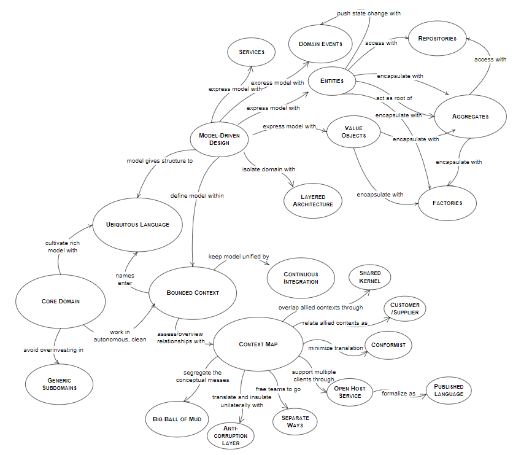

# DDD Lightning Tour

The [Wikipedia](https://en.wikipedia.org/wiki/Domain-driven\_design) definition is actually very good and condensed. Let's check it out:

> **Domain-driven design** (**DDD**) is a [software design](https://en.wikipedia.org/wiki/Software\_design) approach focusing on modelling software to match a [domain](https://en.wikipedia.org/wiki/Domain\_\(software\_engineering\)) according to input from that domain's experts.
>
> In terms of [object-oriented programming](https://en.wikipedia.org/wiki/Object-oriented\_programming) it means that the structure and language of software code (class names, [class methods](https://en.wikipedia.org/wiki/Class\_method), [class variables](https://en.wikipedia.org/wiki/Class\_variable)) should match the [business domain](https://en.wikipedia.org/wiki/Business\_domain). For example, if a software processes loan applications, it might have classes like `LoanApplication` and `Customer`, and methods such as `AcceptOffer` and `Withdraw`.
>
> DDD connects the [implementation](https://en.wikipedia.org/wiki/Implementation) to an evolving model.
>
> Domain-driven design is predicated on the following goals:
>
> * placing the project's primary focus on the core [domain](https://en.wikipedia.org/wiki/Domain\_\(software\_engineering\)) and domain logic;
> * basing complex designs on a model of the domain;
> * initiating a creative collaboration between technical and [domain experts](https://en.wikipedia.org/wiki/Domain\_expert) to iteratively refine a conceptual model that addresses particular domain problems.

TODO

Core to understanding Domain Driven Design is understanding what _domain_ means. The domain can be distilled into a _model_**.**

There is a beautiful [Borges](https://en.wikipedia.org/wiki/Jorge\_Luis\_Borges) quote that you may be familiar with:

> “In this empire, the art of cartography was taken to such a peak of perfection that the map of a single province took up an entire city and the map of the empire, an entire province. **In time, these oversize maps outlived their usefulness and the college of cartographers drew a map of the empire equal in format to the empire itself, coinciding with it point by point**. The following generations, less obsessed with the study of cartography, decided that this overblown map was useless and somewhat impiously abandoned it to the tender mercies of the sun and seasons. There are still some remains of this map in the western desert, though in very poor shape, the abode of beasts and beggars. No other traces of the geographical disciplines are to be seen throughout the land.”\
> \
> — Jorge Luis Borges in [_A Universal History of Infamy_](http://en.wikipedia.org/wiki/A\_Universal\_History\_of\_Infamy), 1946 (from [https://www.thepolisblog.org/2012/10/jorge-luis-borges-on-empire-and.html](https://www.thepolisblog.org/2012/10/jorge-luis-borges-on-empire-and.html))

Besides being the nightmare of enterprise architects and surveyors, grand maps (or schemas) that intend to explain everything can devolve into reprehensible detail. That's where the very human ability to abstract complex knowledge into models comes in.

Eric Evans spends quite some space in the start of his book on the notion of a "model" and what model-driven design means. Being model-driven can be likened to virtually being domain-driven. By having a shared understanding, and respecting that there is a need for zooming in/out, we can condense our knowledge to an efficient and useful model.

TODO more

### The patterns of DDD

## Domain Driven Design overview

DDD was a game changer (and is still somewhat singular) in that it insists on software being not just the engineering part, but also how it logically connects the physical and very real business end to software to accurately represent those ideas. Therefore, DDD was from the start contingent on _language_ as a primary tool to create cohesion and allow for expressive and rich modeling. It also came with many prescriptive ideas divided between the higher-level "strategic DDD" and the implementation patterns part of the "tactical DDD".

Domain Driven Design has grown in the 20-odd years it's been around to be a foundational part of modern software architecture and shaping the methodology with which many work in software. It seems to have been given an enormous upswing after the microservices pattern become more in vogue some 5-10 years ago.

For me personally, reading about Domain Driven Design—first through articles and then through the [blue book](https://www.domainlanguage.com/ddd/blue-book/) and [red book](https://kalele.io/books/)—made for an exciting summer some years back: It was really obvious (!) that we need to connect the "business" with the implementation. The explosive thing about the books, however, was that they went well and beyond the platitudes of the _statement_ (as you read it in the last sentence) to actually detailing patterns, strategies and ways to actually get there.

The "problem", if one can call it that, is that both of the books are big. Like really big. I think they fall squarely into the lap of certain types of folks who still enjoy the intellectual exercise and sometimes relatively abstract way of learning that goes with the territory. Thankfully there are complementary resources to pad out your understanding—though as always with this type of literature, it is wise to understand the source material.

Already Vernon wrote in his first book that sometimes DDD is "first embraced as a technical tool set" (Vernon 2013, p. xxi) saying that some refer to this modus as "DDD-Lite". This will bring forth a number of useful patterns, but will miss out on the glue that binds together DDD as a complete concept.

## Tactical DDD

See [https://docs.microsoft.com/en-us/azure/architecture/microservices/model/tactical-ddd](https://docs.microsoft.com/en-us/azure/architecture/microservices/model/tactical-ddd)

From [https://thedomaindrivendesign.io/what-is-tactical-design/](https://thedomaindrivendesign.io/what-is-tactical-design/)

The _Tactical Design_ helps us create an elegant _Domain Model_ using _Building Blocks_, see below the main _Building Blocks_:

You need to understand that not all of these concepts need to be applied to your _Domain Model_, you need to do an analysis so that it does not add unnecessary complexity to your project.
