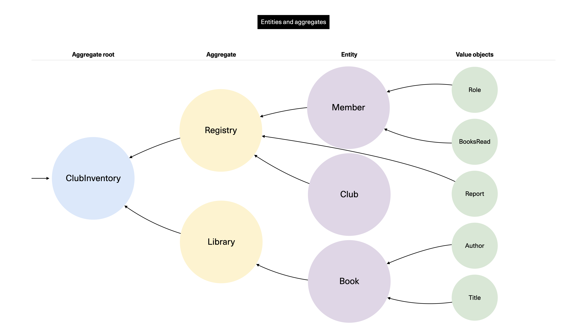

# Aggregates

<figure><figcaption><p>Illustration from <a href="https://undraw.co/">Undraw</a></p></figcaption></figure>


**TL;DR**

The **Aggregate** can be confusing. It has two common meanings.

The "correct" and orthodox one is that the **Aggregate** is simply an Entity that itself "owns" or links other Entities in a logical whole. This entails that **Aggregates,** like entities, each have their own unique identity. The highest-level Aggregate is called the **Aggregate Root**. There must be no way to access "deeper" entities without passing the **Aggregate Root**, or whichever other construct is highest.

For the secondary, more colloquial meaning it can mean the actual "data object" that we are operating on. While not technically always correct, I find the **Aggregate** term slightly better than saying things like "I will access the X entity through the API". At least for me, I find it better at expressing a data source, while Entity is more of a thing.

Moreover, the **Aggregate** acts as the _transaction boundary_ so it completely deals with all the data that it pertains to. You should never modify more than a single **Aggregate** per database transaction. Any changes to the **Aggregate** result in the **Aggregate** publishing a Domain Event.


<figure><figcaption><p>Aggregates reside in the Domain layer.</p></figcaption></figure>

For the "truth" on the matter of aggregates, we will look no further than to the Big Blue Book:

> An aggregate is a cluster of associated objects that we treat as a unit for the purpose of data changes. Each Aggregate has a root and a boundary. The boundary defines what is inside the Aggregate. The root is a single, specific Entity contained in the Aggregate. The root is the only member of the Aggregate that outside objects are allowed to hold references to, although objects within the boundary may hold references to each other. Entities other than the root have local identities, but that identity needs to be distinguishable only within the Aggregate, because no outside object can ever see it out of the context of the root Entity.
>
> — Source: Eric Evans, _Domain Driven Design: Tackling Complexity in the Heart of Software_ (p. 126-127)


The Aggregate is the most complex pattern, for sure. It is the one I myself have had to contend most with.

I hope to get across the fundamentals here, but let it be known that _a lot_ of paper has been printed around various ways to think about them, referencing other Aggregate Roots, data modeling, efficient persistence, and so on.

Get a coffee, you deserve it, and don't sweat it all here and now. Read up and evolve when you have gotten your [sea legs](https://www.marineinsight.com/life-at-sea/what-does-the-term-get-your-sea-legs-means/).


Revisiting our relations between aggregates and entities we see the fundamental items to understand include:

* Aggregates are mostly just Entities with extra responsibilities; more on these in a moment. The opposite case is however not necessarily true.
* Aggregates are the only objects that access and operate on Entities.
* An Aggregate Root is an object that can access the root object (Entity) that itself may collect a group of entities. The Aggregate Root concept becomes more important and pronounced when you have a rich domain with relations between Entities.

The below conceptual diagram should give you an idea of how this might actually work.

<figure><figcaption><p>Conceptual demonstration of an deeply-clustered Aggregate Root. This particular model may or may not make actual sense (given that it's simply an example) but we can be quite certain that the orchestration of this will be non-trivial.</p></figcaption></figure>

Being an Aggregate means that you add a number of additional characteristics to the Entity's existential features:

* **Consistency enforcement** is Job #1 for the Aggregate. It has to ensure changes are correct and consistent.
* **Acts as a transaction boundary**: Aggregates use their own business/domain logic to modify data. You must not use more than a single Aggregate instance per transaction.
* **Enforces the hierarchy of entities**. Multiple entities and/or value object may be part of the same transaction, and updating them must always be done as a shared transaction only _after verification_ of rules and checks.
* The rule of thumb for referencing other aggregates is that **any entities that must be in strongly consistent state should be within the same aggregate boundary**. Anything else is some other Aggregate's job and may be eventually consistent. Work to minimize Aggregate boundaries to the smallest, logically possible ones.
* **Domain events are emitted** to integrate with other systems (and Aggregates) whenever a transaction is completed.

And as with other object types, **Aggregates use the ubiquitous language to reflect the domain model**.


See Vlad Khononov's _Learning Domain Driven Design: Aligning Software Architecture and Business Strategy_ (2021, p.84-92).


## Do we have Aggregates in the example project?

Yes and no.

No, because there is no high-level object of that variety that is containing multiple Entities or similar objects. We only have the "flat" Entity named `Slot`.

Yes, because our only Entity for the above reason automatically becomes the Aggregate Root. For practical reasons, we might not want to use that term all the time when we work, and especially not if there is no need for such a concept in a basic domain model like the one in our example project.

## How large is an Aggregate?

<figure><figcaption><p>Come on, the question was begging for this meme.</p></figcaption></figure>

Vaughn Vernon recommends in _Implementing Domain Driven Design_ that you should strive to **design small aggregates** (p. 355-359). He shows how large-cluster Aggregates will scale and perform poorly, as well as become very complicated to reason about. The technical issues stem from factors such as needing to load more data, possibly from more sources, while also exposing more transactional areas for failure. The bigger the Aggregate the more cumbersome it will become regardless of dimension, whether technical or cognitive.

If a given operation needs to have strong consistency across multiple Aggregates, then that should give a hint that there is poor design at play.

## What we mean with transactions

A _Transaction_ is the broad DDD term for committing something from start to (persisted) finish.

Recall how it's already been stated that the Aggregate Root (and Entities, in essence) serves as a consistency boundary. What that means in practice is that anything to do with controlling that the data is correct (valid) and that it gets persisted in the right way is in the responsibility of the respective Aggregate. Anything outside the direct responsibility of the Aggregate is someone else's work. You should attempt to shed as much load as possible, while staying truthful to the business domain, when you decide what work is on the shoulders of an Aggregate. Vernon also writes on that issue:

> Just because you are given a use case that calls for maintaining consistency in a single transaction doesn't mean you should do that. Often, in such cases, the business goal can be achieved with eventual consistency between Aggregates. The team should critically examine the use cases and challenge their assumptions, especially when following them as written would lead to unwieldy designs.
>
> — Source: Vaughn Vernon, Implementing Domain Driven Design, p. 359

Eventual consistency in practice means that we'll offload the change to some other system, rather than stay inside the same process and synchronously await the change. Or worse: have to keep all that logic in "our" solution. Vernon discussed the common question of when to use (and not to use) eventual consistency. Evans answered that someone else's job should always be deemed eventually consistent from "our" angle:

> When examining the use case (or story), ask whether it's the job of the user executing the use case to make the data consistent. If it is, try to make it transactionally consistent, but only by adhering to the other rules of Aggregates. If it is another user's job, or the job of the system, allow it to be eventually consistent. That bit of wisdom not only provides a convenient tie breaker, but it helps us gain a deeper understanding of the domain. It exposes the real system invariants: the ones that must be kept transactionally consistent.
>
> — Source: Vaughn Vernon, Implementing Domain Driven Design, p. 367

OK, so that sounds good and all but how does that actually work? Easy: Domain Events.

### Aggregates emit Domain Events

We haven't discussed Domain Events in detail yet, as these will come up in an upcoming section, but the way in which the Aggregate informs the rest of the landscape is through events, specifically in the DDD context, Domain Events.

A Domain Event is, in short, an event (or message) pushed to some asynchrononous messaging technology where consumers can subscribe to new events unfolding. We give events their own identity, in effect transforming them from just a blob with some data into a fully-fleshed Domain Event that "speaks" our domain's language. By using them we can stitch together interactions across many systems in our landscape without foregoing any of the rich vocabulary we have created through DDD and EventStorming.

Let's look more at this later.

## Our domain service as a stand-in

Our code base for the Reservation solution has the following more substantial ingredients:

* A number of use cases
* A number of application services
* The `Slot` Entity
* The `ReservationService` Domain Service


We inspected the code already in the Services section. For brevity, I will avoid reproducing it here once again. Instead we will look at selected sections.

The code itself is located at `code/Reservation/SlotReservation/src/domain/services/ReservationService.ts` if you want to see the full source.


Before looking too intently at the code itself, I'll clarify the way that I am using a Domain Service to do the Aggregate-type operations on top of our `Slot` Entity.

### Why is this handled in a Domain Service rather than directly in the use case?

Good question!

In typical DDD fashion we would not want to move the persistence concern (even with a Repository) into the domain layer, but want to keep these in the application layer. However, the actual code that gets executed has more of a domain character than pure application chaff. We can see this in the nature of the code itself—such as orchestrating the entity and creating events—as well as checking our resulting imports: we directly link to the `Slot` entity and the events, all of which are in the domain.

Secondly, there is a lot of wiring that needs to be done. By placing all of that into a stateless, separate class rather than in the functionally oriented use cases we can avoid having to rewrite a lot of code.

Thirdly, as we have learned, Aggregates (a domain level object) are the only objects that in strict DDD may emit Domain Events. This puts us in a weird place: we have implemented the `DomainEventPublisherService` as an Application Service because it's kind of a low-level, infrastructural thing. So while persisting is then a low-tier activity, the Aggregate is at the top of the food chain, and this brings us to an unfortunate TODO

At the end of the day it is not about being orthodox but by being clear and domain-oriented in our code. I am sure Evans and Vernon and others might find any number of details to complain about, but the way _it actually is_ implemented is hopefully clear enough; this is the real goal, not dogmatism.

### Why is this a Domain Service and not an Aggregate?

Services are something we try to avoid in DDD (as long as we can put behavior on "things" instead) and the uses I understand them to be best for include typical "heavy lifting", not necessarily being important orchestrators. The `SlotReservation` aggregate has quite a bit of such orchestration happening on the `Slot` entity and more.

The service is stateless and identity-less, so it can't be an Entity or Aggregate.

It's not an Entity because it doesn't handle anything concrete _on_ anything.

I really want to avoid injecting Repositories or Domain Event Publishers into the `Slot` Entity, so something else has to abstract that. However, not even a Domain Layer _should_ access such things, but it's generally not seen as a capital offense. :sweat\_smile:


Here's an example of a Stack Overflow answer that also makes the point that it's acceptable to inject a Repository into a Domain Service: [https://softwareengineering.stackexchange.com/a/330435](https://softwareengineering.stackexchange.com/a/330435).


It _does act_ like an Aggregate as it functions as the "entry point" to the `Slot` entity that we actually operate on and persist. We also send the Domain Events from here: it therefore acts is the transaction boundary.

And that's how we ended up in this compromise. Don't let DDD become dogma. Be humble and realistic and if it makes sense to you and you can explain the reasoning, at the very least we are dealing with considered and deliberate design which after all is the real goal.

## Examples from our project

### Use case #1: Make daily slots

The first publicly accessible use case is for making the daily slots. This one is also one of the longer ones as it has to deal with more setup than the other ones.

```typescript
/**
 * @description Make all the slots needed for a single day (same day/"today").
 *
 * "Zulu time" is used, where GMT+0 is the basis.
 *
 * @see https://time.is/Z
 */
public async makeDailySlots(): Promise<void> {
  const slots: SlotDTO[] = [];

  const timeSlot = new TimeSlot();
  const currentTime = this.getCurrentTime();
  const numberHours = 10;
  const startHour = 8;

  for (let slotCount = 0; slotCount < numberHours; slotCount++) {
    const hour = startHour + slotCount;
    const { startTime, endTime } = timeSlot.startingAt(hour);
    const newSlot = this.makeSlot({ currentTime, startTime, endTime });
    slots.push(newSlot);
  }

  const addSlots = slots.map(async (slot: SlotDTO) => {
    await this.repository.updateSlot(slot);

    const { slotId, hostName, slotStatus, timeSlot } = slot;

    const event = new CreatedEvent({
      event: {
        eventName: 'CREATED', // Transient state
        slotId,
        slotStatus,
        hostName,
        startTime: timeSlot.startTime
      },
      eventBusName: this.domainBusName,
      metadataConfig: this.metadataConfig
    });

    await this.emitEvents(event);
  });

  await Promise.all(addSlots);
}
```

TODO

### Use case #2: Check in

The rest of the use cases have a format that resembles the one we look at here, the "check in" case.

We load a slot based on the ID we have received, destructure some fields, verify that we have the correct slot status (it must be `RESERVED` to work), and then call our private `updateSlot()` method with the slot data and new status. When that's done it's time to make the correct event (here, the `CheckedInEvent`) and emit that with our private `emitEvents()` method.

All in all, we have ensured the state satisfies our business needs, the new invariant is correctly shaped, made the update, and informed our domain of the change via an event.

```typescript
/**
 * @description Updates a Slot to be in `CHECKED_IN` invariant state.
 *
 * Can only be performed in `RESERVED` state.
 *
 * @emits `CHECKED_IN`
 */
public async checkIn(slotId: SlotId): Promise<void> {
  const slot = await this.loadSlot(slotId);
  const { slotStatus, hostName, timeSlot } = slot;
  const { startTime } = timeSlot;
  if (slotStatus !== 'RESERVED') throw new CheckInConditionsNotMetError(slotStatus);

  const newStatus = 'CHECKED_IN';
  await this.updateSlot(slot, newStatus);

  const event = new CheckedInEvent({
    event: {
      eventName: newStatus,
      slotId,
      slotStatus: newStatus,
      hostName,
      startTime
    },
    eventBusName: this.domainBusName,
    metadataConfig: this.metadataConfig
  });

  await this.emitEvents(event);
}
```

TODO

### Use case #3: Reserve slot

Because this one has to take in a user's input data it becomes very important that we validate the input and sanitize it. That becomes the first thing we do.

Next, we load the slot data for the requested slot, destructure the data for use, verify that the slot status is correct or else we throw an error. Then we get a verification code using a private method that will get it from an external service in another (sub)domain. If something goes awry, we throw an error.

Now it's just the home stretch: Update the slot with the correct shape and data, build a `ReservedEvent` and emit it to our domain. Finally, return the `ReserveOutput` object with the verification code we received so that the user can jot it down and use it when the time comes to check in.

```typescript
/**
 * @description Updates a Slot to be in `RESERVED` invariant state.
 *
 * Can only be performed in `OPEN` state.
 *
 * @emits `RESERVED`
 */
public async reserve(slotInput: SlotInput): Promise<ReserveOutput> {
  this.validateInputData(slotInput, true);
  const { slotId, hostName } = slotInput;

  const slot = await this.loadSlot(slotId);
  const { slotStatus, timeSlot } = slot;
  const { startTime } = timeSlot;
  if (slotStatus !== 'OPEN') throw new ReservationConditionsNotMetError(slotStatus);

  // We do the verification code stuff before committing to the transaction
  const verificationCode = await this.getVerificationCode(slotId);
  if (!verificationCode) throw new FailedGettingVerificationCodeError('Bad status received!');

  const newStatus = 'RESERVED';

  await this.updateSlot(
    {
      ...slot,
      hostName: hostName || ''
    },
    newStatus
  );

  const event = new ReservedEvent({
    event: {
      eventName: newStatus,
      slotId,
      slotStatus: newStatus,
      hostName,
      startTime
    },
    eventBusName: this.domainBusName,
    metadataConfig: this.metadataConfig
  });

  await this.emitEvents(event);

  return {
    code: verificationCode
  };
}
```

TODO
