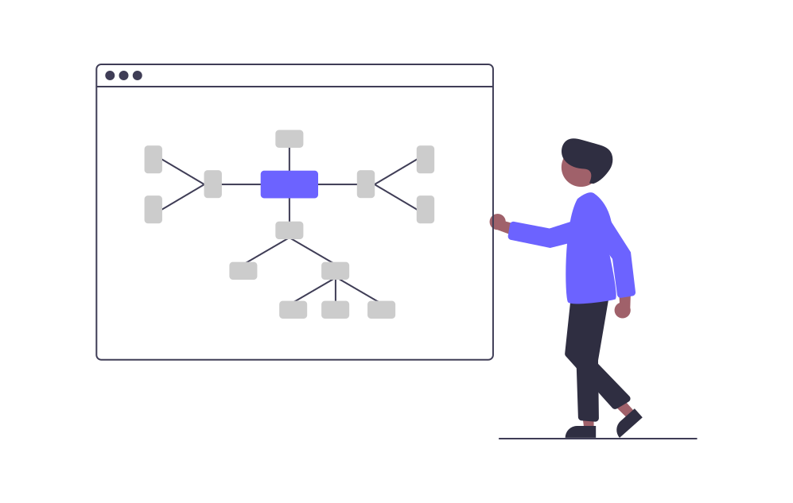
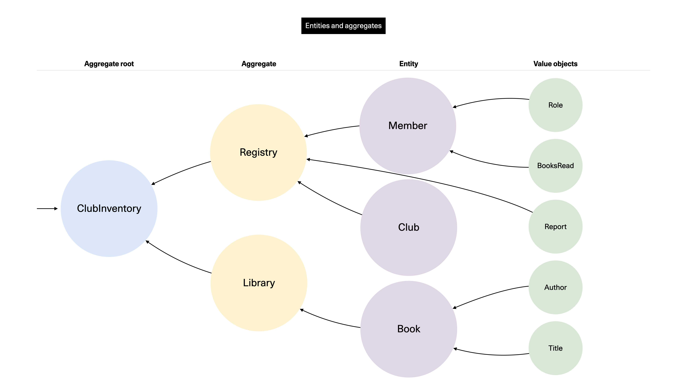

# Aggregates

<figure><figcaption><p>Illustration from <a href="https://undraw.co/">Undraw</a></p></figcaption></figure>


**TL;DR**

The **Aggregate** can be confusing.  It has two common meanings.

The "correct" and orthodox one is that the **Aggregate** is simply an Entity that itself "owns" other Entities. This entails that **Aggregates,** like entities, each have their own unique identity. The highest-level Aggregate is called the Aggregate Root. There must be no way to access "deeper" entities without passing the Aggregate Root, or whichever other construct is highest.

For the secondary meaning, it can mean (in general) the actual "data object" that we are operating on. While not technically always correct, I find the **Aggregate** term slightly better than saying things like "I will access the X entity through the API". At least for me, I find it better at expressing a data source, while Entity is more of a thing.


Looking in the Big Blue Book we'll read the following:

> An aggregate is a cluster of associated objects that we treat as a unit for the purpose of data changes. Each Aggregate has a root and a boundary. The boundary defines what is inside the Aggregate. The root is a single, specific Entity contained in the Aggregate. The root is the only member of the Aggregate that outside objects are allowed to hold references to, although objects within the boundary may hold references to each other. Entities other than the root have local identities, but that identity needs to be distinguishable only within the Aggregate, because no outside object can ever see it out of the context of the root Entity.
>
> — Source: Eric Evans, DDD book (p. 126-127)

TODO

Revisiting our relations between aggregates and entities we see that:

* Entities are objects that have unique identity. They are closely connected to the domain and its business logic.
* Aggregates are objects that access and operate on entities. To be clear, an aggregate is always itself an entity, but the opposite is not necessarily true.
* An Aggregate Root is an object that can access the root object/entity collecting a group of entities. The Aggregate Root concept becomes more important and pronounced when you have a rich domain with relations between entities.

TODO

## How large is an Aggregate?

<figure><figcaption><p>Come on, the question was begging for this meme.</p></figcaption></figure>

Vaughn Vernon recommends in _Implementing Domain Driven Design_ that you should strive to design small aggregates (p. 355-359). He shows how large-cluster Aggregates will scale and perform poorly, as well as become very complicated to reason about. The technical issues stem from factors such as needing to load more data, possibly from more sources, while also exposing more transactional areas for failure.

## What we mean with transactions

Recall how the Aggregate Root (and Entities, in essence) serves as a consistency boundary. TODO

Also, as we will see more in the Events section, he writes:

> Just because you are given a use case that calls for maintaining consistency in a single transaction doesn't mean you should do that. Often, in such cases, the business goal cam be achieved with eventual consistency between Aggregates. The team should critically examine the use cases and challenge their assumptions, especially when following them as written would lead to unwieldy designs.
>
> — Source: Vaughn Vernon, Implementing Domain Driven Design, p. 359

TODO

> When examining the use case (or story), ask whether it's the job of the user executing the use case to make the data consistent. If it is, try to make it transactionally consistent, but only by adhering to the other rules of Aggregates. If it is another user's job, or the job of the system, allow it to be eventually consistent. That bit of wisdom not only provides a convenient tie breaker, but it helps us gain a deeper understanding of the domain. It exposes the real system invariants: the ones that must be kept transactionally consistent.
>
> — Source: Vaughn Vernon, Implementing Domain Driven Design, p. 367

TODO

<figure><figcaption><p>Conceptual demonstration of an deeply-clustered Aggregate Root. This particular model may or may not make actual sense (given that it's simply an example) but we can be quite certain that the orchestration of this will be non-trivial.</p></figcaption></figure>

TODO

## Our domain service as a stand-in

I wouldn't be surprised if you already are aware that we'll be looking at the meatiest and most significant part of our codebase. This is good! If we have it this far, using the other tactical concepts, we are truly now at the core of the business logic.

Expect a much longer read this time. No worries, we are going to look at select parts in due course.


We inspected the code already in the Services section. For brevity, I will avoid repoducing it here once again. Instead we will look at selected sections.

The code itself is located at `code/Reservation/SlotReservation/src/domain/services/ReservationService.ts` if you want to see the full source.


## Stepping through the code

TODO REVISE As expected, there's the standard imports, but there is no Factory function. I just don't often find it very helpful to encapsulate an aggregate using one.

The code in the class is in two major chunks: Private methods and the public ("API") methods.

The examples will be presented in "roughly" sequential order, though logically reservation comes before the check-in. Those are switched in order because I want to gradually progress on their relative complexity (what little there is).

### Why is this a Domain Service and not an Aggregate?

You might have noticed that our `ReservationService` aggregate was indeed called an _aggregate_, yet it has no ID or similar (as per expectations on aggregates), nor did it carry state on itself. Well spotted.

My reasons for doing it this way include:

* Services are something we try to avoid in DDD, and the uses I understand them to be best for include typical "heavy lifting", not necessarily being important orchestrators. The `SlotReservation` aggregate has quite a bit of such orchestration happening on the `Slot` entity and more.
* It's not an entity because it does not handle something, on its own, concrete.
* It's not reduced to orchestration bits-and-bobs in the use case either. This for me seems right, coming from the Clean Architecture angle, though there is too much domain logic and entity operations for me to feel that would be right.
* Finally: It _does_ act like an aggregate as it functions as the "entry point" to the value object (generation) and the `Slot` entity that we actually operate on and persist. We also send the domain events from here: It is the transaction boundary.

And that's how we ended up in this compromise. Don't let DDD become dogma. Be humble and realistic and if it makes sense to you and you can explain the reasoning, at the very least we are dealing with considered and deliberate design which after all is the real goal.


Here's an example of a Stack Overflow answer that also makes the point that it's acceptable to inject a Repository into a Domain Service: [https://softwareengineering.stackexchange.com/a/330435](https://softwareengineering.stackexchange.com/a/330435).


\++++

### Use case #1: Make daily slots

The first publicly accessible use case is making the daily slots. This one is also one of the longer ones as it has to deal with more setup than the other ones.

```typescript
/**
 * @description Make all the slots needed for a single day (same day/"today").
 *
 * "Zulu time" is used, where GMT+0 is the basis.
 *
 * @see https://time.is/Z
 */
public async makeDailySlots(): Promise<void> {
  const slots: SlotDTO[] = [];

  const timeSlot = new TimeSlot();
  const currentTime = this.getCurrentTime();
  const numberHours = 10;
  const startHour = 8;

  for (let slotCount = 0; slotCount < numberHours; slotCount++) {
    const hour = startHour + slotCount;
    const { startTime, endTime } = timeSlot.startingAt(hour);
    const newSlot = this.makeSlot({ currentTime, startTime, endTime });
    slots.push(newSlot);
  }

  const addSlots = slots.map(async (slot: SlotDTO) => {
    await this.repository.updateSlot(slot);

    const { slotId, hostName, slotStatus, timeSlot } = slot;

    const event = new CreatedEvent({
      event: {
        eventName: 'CREATED', // Transient state
        slotId,
        slotStatus,
        hostName,
        startTime: timeSlot.startTime
      },
      eventBusName: this.domainBusName,
      metadataConfig: this.metadataConfig
    });

    await this.emitEvents(event);
  });

  await Promise.all(addSlots);
}
```

### Use case #2: Check in

The rest of the use cases have a format that resembles the one we look at here, the "check in" case.

We load a slot based on the ID we have received, destructure some fields, verify that we have the correct slot status (it must be `RESERVED` to work), and then call our private `updateSlot()` method with the slot data and new status. When that's done it's time to make the correct event (here, the `CheckedInEvent`) and emit that with our private `emitEvents()` method.

All in all, we have ensured the state satisfies our business needs, the new invariant is correctly shaped, made the update, and informed our domain of the change via an event.

```typescript
/**
 * @description Updates a Slot to be in `CHECKED_IN` invariant state.
 *
 * Can only be performed in `RESERVED` state.
 *
 * @emits `CHECKED_IN`
 */
public async checkIn(slotId: SlotId): Promise<void> {
  const slot = await this.loadSlot(slotId);
  const { slotStatus, hostName, timeSlot } = slot;
  const { startTime } = timeSlot;
  if (slotStatus !== 'RESERVED') throw new CheckInConditionsNotMetError(slotStatus);

  const newStatus = 'CHECKED_IN';
  await this.updateSlot(slot, newStatus);

  const event = new CheckedInEvent({
    event: {
      eventName: newStatus,
      slotId,
      slotStatus: newStatus,
      hostName,
      startTime
    },
    eventBusName: this.domainBusName,
    metadataConfig: this.metadataConfig
  });

  await this.emitEvents(event);
}
```

### Use case #3: Reserve slot

Because this one has to take in a user's input data it becomes very important that we validate the input and sanitize it. That becomes the first thing we do.

Next, we load the slot data for the requested slot, destructure the data for use, verify that the slot status is correct or else we throw an error. Then we get a verification code using a private method that will get it from an external service in another (sub)domain. If something goes awry, we throw an error.

Now it's just the home stretch: Update the slot with the correct shape and data, build a `ReservedEvent` and emit it to our domain. Finally, return the `ReserveOutput` object with the verification code we received so that the user can jot it down and use it when the time comes to check in.

```typescript
/**
 * @description Updates a Slot to be in `RESERVED` invariant state.
 *
 * Can only be performed in `OPEN` state.
 *
 * @emits `RESERVED`
 */
public async reserve(slotInput: SlotInput): Promise<ReserveOutput> {
  this.validateInputData(slotInput, true);
  const { slotId, hostName } = slotInput;

  const slot = await this.loadSlot(slotId);
  const { slotStatus, timeSlot } = slot;
  const { startTime } = timeSlot;
  if (slotStatus !== 'OPEN') throw new ReservationConditionsNotMetError(slotStatus);

  // We do the verification code stuff before committing to the transaction
  const verificationCode = await this.getVerificationCode(slotId);
  if (!verificationCode) throw new FailedGettingVerificationCodeError('Bad status received!');

  const newStatus = 'RESERVED';

  await this.updateSlot(
    {
      ...slot,
      hostName: hostName || ''
    },
    newStatus
  );

  const event = new ReservedEvent({
    event: {
      eventName: newStatus,
      slotId,
      slotStatus: newStatus,
      hostName,
      startTime
    },
    eventBusName: this.domainBusName,
    metadataConfig: this.metadataConfig
  });

  await this.emitEvents(event);

  return {
    code: verificationCode
  };
}
```

TODO

\---------

### Importing services


Hold on to your feelings, if I've converted you to a Mini-Me version of Uncle Bob or Eric Evans!


At the top of the file we are making a whole bunch of imports. Some of them are unreasonable to not import (at least in TypeScript) like types/interfaces, errors (and other "global" functionality), and similar.

**When it comes to services, this importing may be pretty contentious to purists.**

In DDD (and Googling or reading on Stack Overflow) you'll hear a lot of arguments against importing outer-level objects (such as services) in deeper-level objects, such as aggregates. This is sound advice, generally speaking. If we start importing left-right-and-center without discipline we will end up in a really bad place.

Our particular case, however, is sensible. Let me present some of my arguments:

* **Aggregates are one of the most important objects that express our business logic in the language of the domain**. The aggregate is very big, and _was_ even bigger. At an earlier stage it included quite a few private methods that are now imported from the application and domain layer after a bit of refactoring. To actually do these things we need bits and bobs to help with sometimes menial tasks. It is reasonable to refactor those parts into functional services.
* **Refactoring them from private methods to functional services means that their testability is improved**, should we want to write function/class-specific tests for these.
* **Extracting these methods into services also allow better reuse**, though to be frank, right now there is no such need.
* OK, so with them refactored to services, why don't we inject them instead? This too is sensible. **However, I decided against injecting them becomes this would create significant up-front bloat** across the use cases, or worse (but more pure), in the web adapters. This will carry down to affecting many of the tests as well. At this stage it is simply more pragmatic to accept the direct importing of services. The tests already cover enough to guarantee that any mischievous work in the services would be caught.

And with no more than that, to each his own, but it's a realistic as well as solid approach, without compromising too much on the integrity of the Clean Architecture and DDD principles.

\++++
