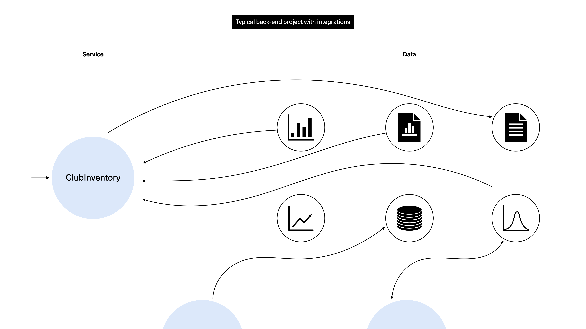

# Entities

<figure><figcaption><p>Illustration from <a href="https://undraw.co/">Undraw</a></p></figcaption></figure>


**TL;DR**

**Entities** are maybe the reason you learned about DDD in the first place. At their heart, the **Entity** is concerned first and foremost about the virtues of conventional OOP and SOLID, and not accepting passing dumb data containers around.

Every **Entity** has a unique identity. We use **Entities** to wedge in domain logic on "things" rather than abstract "SomethingServices" and other techno-speak that divorces the domain from the coded implementation. By operating on these things (**Entities**) with clear business/domain logic we solve a lot of poor programming practices.

**Entities** and Aggregates are practically the same, with the difference being that an **Entity** is a _thing_ while an Aggregate represents a cluster of _things_.


<figure><figcaption><p>Entities reside in the Domain layer.</p></figcaption></figure>

Entities and Aggregates are perhaps the most "prominent" of the tactical patterns. It's important to understand that the notion of Entities in database-adjacent contexts and in implementation-oriented tools like Entity Framework _are not the same thing_.


**Beware of snake oil salesmen**

DDD has nothing to do with persistence technologies or databases. In fact, when taking a DDD approach and combining it with your required persistence tech, you'll most likely see that there are no shortcuts—you'll have to do the modeling and so forth on your own. Tools that "sell" how they map to DDD, like Entity Framework and some Object Relational Mappers, will not help you in any meaningful way.


Both of these concepts are very much related, and it probably makes sense to start with the more general of them: The Entity.

Entities are objects that may mutate (change) over time, and who all have distinct identities. We can think of a `BookClubMember` as something that feels quite right being an Entity as it implies a person and identity behind it. On the other hand, a `Meeting` may be a simple Value Object (more on these later), as it has neither a unique identity nor will it change after the fact. All in all, it's easy to see how a `BookClubMember` will be a much less simple construct than the `Meeting`.

Our example `BookClubMember` will most likely involve both **data** (such as identity, books read, membership date) and **behavior** (such as updating the member's address). It will also contain its own clear **business rules** attached to such behaviors, where a prospective rule could be something like renewing membership only _after_ having paid the member's fee.

Entities are persisted (saved, loaded) with a Repository in the shape of a Data Transfer Object. Before using them in your code, you "turn them into" DTOs or into Entities. DTOs must never be directly mutated.

**Let's make it all ultra clear**: An Entity is an _object_. Most often we represent these as classes. Because a class can contain data we can logically manipulate that data. The way we manipulate the data is through methods on the Entity class that correspond to our common (ubiquitous) language; We don't let anyone directly manipulate the data on the Entity instance. We can save a representation of the Entity's data (state) with a Repository and we can load back the data and reconstitute it into a valid Entity instance when needed. All of that would happen in the same Bounded Context, in our case, in the same solution (in turn consisting of Lambda functions).

## Splitting data and behavior leads to unmaintainable code

In the world of traditional back-end engineering you might find something like the below diagram: A service that interacts with several data sources. Because all of these are distinct and separated we have no good idea of who owns, and may change, what source. In the bottom we have the faint contours of other services, too.

It's not uncommon that we for example:

* Go with a data synchronization approach, where we duplicate data on our end (this may even be two-way but let's skip that idea for now). While it's easier today in the public cloud to set these things up, many times you'll still face the consequences of having to deal with data decoupled from the business logic (behavior). Further, you may get a problematic mix of eventual and strong consistency which could break transactional flows.
* Decide to only read back data, making integration easier, but the resiliency and performance worse. An issue here is that at any point where a feature is needed that can update data, you will have a hard time getting that solution to be scalable, secure, and logical as the landscape is now polluted with multiple writers of the same leading data.

Either case will be poor in different ways.

<figure><figcaption><p>Conceptual diagram of tangled integrations where separation of data and behavior leads to uncertainty of who can mutate data in which ways.</p></figcaption></figure>

While in theory we have decoupling here, in essence we also have created an even bigger problem: An **anemic domain model**.

### The "anemic domain model"

The [anemic domain model](https://martinfowler.com/bliki/AnemicDomainModel.html) is one that represents objects as shells, or husks, of their true capabilities. They will often be [CRUDdy](https://verraes.net/2013/04/crud-is-an-anti-pattern/) as they allow for direct mutations through public getters and setters. It can quickly becomes hard to understand all the places in a codebase in which the data is manipulated, and how it was done.


**Good code does more than just compile**

Some find the criticism around "anemic domain models" academic and roundly wrong. They might argue that their experiences are that it's just as easy to get things to work, but with less hassle than going full-on with OOP.

Remember Robert Martin's words from [_Clean Code: A Handbook of Agile Software Craftsmanship_](https://www.goodreads.com/book/show/3735293-clean-code): "It is not enough for code to work."

Speaking personally, for me code quality and structure are paramount when building something or when I work with (or coach) other engineers.

All this _is_ measurable, once you have access to the code and not just raving to some rando on an internet forum. Using competent tooling you will likely get recommendations to fix issues like this, too. [Good OOP](https://medium.com/@varvara.munday/reading-books-the-object-oriented-thought-process-by-matt-weisfeld-50d1825ac988) and [refactoring practices](https://refactoring.guru/refactoring) are practically institutionalized so this not "just a DDD thing".

The anemic type of objects will maybe _do the job_, but they will become liabilities too. They do not shield the objects from misuse, nor do they express the common language as succinctly.


The opposite of all of this, no surprises, is the "rich domain model"—really no more than a bit of opinionated ideas on top of your classic object-oriented programming. While that may not technically be the full truth, in our abbreviated version of DDD and the universe, then that explanation is good enough.

## Rich domain models

The rich domain model is how Entities solve the question of "who" can do "what" on a specific dataset.

Compared to their anemic brethren, rich domain models (typically Entities and Aggregates) will be easier to understand, will be more resilient to change and disruptions, and are much better encapsulated; we can always know what object can operate on a set of data, and in which ways it does this. **We centralize the majority of our business logic to these domain objects**, and we can entrust them with that because of this encapsulation and overall correctness of behavior.

**A rich model, in the context of our code, is expressive**. It will use a noun (such as a `Book`), rather than a semantic abstraction (say `BookProcessManagerFactory`) and allows us to act on it. Typically this is verb-based — for example `book.recommend()` to correlate with the actual business terms. As we've seen many times in this book, we want this to explain 1:1 in our common or ubiquitous language what we are doing.

In the below diagram (note that the use case isn't the same as in the last diagram!) you can see how a single `Slot` entity (since it's the only one, it gets "promoted" to Aggregate Root; more on this in the next section) is the surface that contains all the data and behavior required to create the slot for a room reservation. It also handles the `TimeSlot` Value Object as part of the overall Slot. Any changes to the Slot gets pushed as a Domain Event, so that we can inform other Aggregates or the rest of the technical landscape of ongoing changes.

<figure><figcaption><p>Diagram for how user interactions to the Slot ensure the complete transactional boundary for any data it holds.</p></figcaption></figure>

We expose the operations on the `Slot` as calls one can make to our API Gateway, firing the relevant Lambda functions that will orchestrate, through use cases, the operations. Thus we can be totally sure that specific operations are only permissible in a deterministic flow, rather than leak it across our complete solution. Any time we are dealing with an Aggregate or Aggregate Root (as we are here, as the Entity is all alone) we publish a Domain Event detailing what happened, such as `SlotReserved`.

## Invariants

Invariants are "consistency rules that must be maintained whenever data changes" (Evans 2004, p. 128). A complete domain model has no holes in it, in other words, there is no possibility for it to be invalid. This is sometimes called the ["always-valid" model](https://enterprisecraftsmanship.com/posts/always-valid-domain-model/). I highly recommend reading that link, as we will keep it short here.

To actually be to have an always-valid domain model, what would you need to keep in mind?

> * Your domain model should be valid at all times.
> * For that, do the following:
>   * Make the boundary of your domain model explicit.
>   * Validate all external requests before they cross that boundary.
> * Don’t use domain classes to carry data that come from the outside world. Use DTOs for that purpose.
> * You cannot strengthen the invariants in your domain model as it would break backward compatibility with the existing data. You need to come up with a transition plan.
>
> — Source: [https://enterprisecraftsmanship.com/posts/always-valid-vs-not-always-valid-domain-model/](https://enterprisecraftsmanship.com/posts/always-valid-vs-not-always-valid-domain-model/)


See also the following article from Microsoft for more on designing domain-layer validations: [https://learn.microsoft.com/en-us/dotnet/architecture/microservices/microservice-ddd-cqrs-patterns/domain-model-layer-validations](https://learn.microsoft.com/en-us/dotnet/architecture/microservices/microservice-ddd-cqrs-patterns/domain-model-layer-validations)


In plain English, by having moved all the actual domain logic and validations and invariants to the domain layer (where the Entity is the core part), we're already on a good path. We'll see in the code samples some of the basic ways we can handle unique invariants that must be enforced.

## Before we move on

Before we go to the code, let's revisit some highlights.

* Entities are objects that have unique identity. They are the most closely connected to the domain and its business logic of all DDD concepts.
* Entities represent our "dumb data" as actual "things" (nouns) and makes it smart by enabling us a programmatic way to interact with the data in a logical manner rather than just supplying getters and setters to an POJO/POCO/JSON object.
* Entities typically use verbs to express its commands—its public interface.
* We use the ubiquitous language to name these actions and anything else to do with the Entity.
* Entities must always be valid. _Invariants_ is the preferred term for our consistency (and validation) rules.

## The Slot entity

Be ready for one of our biggest and most important classes, the `Slot`.


````typescript
import { randomUUID } from 'crypto';

import { SlotCreateInput, SlotDTO, Status } from '../../interfaces/Slot';
import { TimeSlotDTO } from '../../interfaces/TimeSlot';
import { MakeEventInput } from '../../interfaces/Event';

import { CheckInConditionsNotMetError } from '../../application/errors/CheckInConditionsNotMetError';
import { CheckOutConditionsNotMetError } from '../../application/errors/CheckOutConditionsNotMetError';
import { CancellationConditionsNotMetError } from '../../application/errors/CancellationConditionsNotMetError';
import { ReservationConditionsNotMetError } from '../../application/errors/ReservationConditionsNotMetError';

/**
 * @description The `Slot` entity handles the lifecycle
 * and operations of the (time) slots that users can
 * reserve.
 *
 * @example You can create it at once:
 * ```
 * const slot = new Slot({
 *   startTime: "2022-07-29T12:00:00.000Z",
 *   endTime: "2022-07-29T13:00:00.000Z"
 * });
 * ```
 *
 * You can also reconstitute a Slot from a SlotDTO
 * loaded from a repository:
 * ```
 * const slot = new Slot().fromDto(slotDto);
 * ```
 */
export class Slot {
  private slotId: string;
  private hostName: string;
  private timeSlot: TimeSlotDTO;
  private slotStatus: Status;
  private createdAt: string;
  private updatedAt: string;

  constructor(input?: SlotCreateInput) {
    this.slotId = '';
    this.hostName = '';
    this.timeSlot = {
      startTime: '',
      endTime: ''
    };
    this.slotStatus = 'OPEN';
    this.createdAt = '';
    this.updatedAt = '';

    if (input) this.make(input);
  }

  /**
   * @description Create a valid, starting-state ("open") invariant of the Slot.
   */
  private make(input: SlotCreateInput): SlotDTO {
    const { startTime, endTime } = input;
    const currentTime = this.getCurrentTime();

    this.slotId = randomUUID().toString();
    this.hostName = '';
    this.timeSlot = {
      startTime,
      endTime
    };
    this.slotStatus = 'OPEN';
    this.createdAt = currentTime;
    this.updatedAt = currentTime;

    return this.toDto();
  }

  /**
   * @description Reconstitute a Slot from a Data Transfer Object.
   */
  public fromDto(input: SlotDTO): Slot {
    this.slotId = input['slotId'];
    this.hostName = input['hostName'];
    this.timeSlot = input['timeSlot'];
    this.slotStatus = input['slotStatus'];
    this.createdAt = input['createdAt'];
    this.updatedAt = input['updatedAt'];

    return this;
  }

  /**
   * @description Return data as Data Transfer Object.
   */
  public toDto(): SlotDTO {
    return {
      slotId: this.slotId,
      hostName: this.hostName,
      timeSlot: this.timeSlot,
      slotStatus: this.slotStatus,
      createdAt: this.createdAt,
      updatedAt: this.updatedAt
    };
  }

  /**
   * @description Remove host name from data.
   */
  public removeHostName(): void {
    this.hostName = '';
  }

  /**
   * @description Update host name to new value.
   */
  public updateHostName(hostName: string): void {
    this.hostName = hostName;
  }

  /**
   * @description Updates the common fields to reflect a new `Status`,
   * and also updates the `updatedAt` field.
   *
   */
  public updateStatus(status: Status): void {
    this.slotStatus = status;
    this.updatedAt = this.getCurrentTime();
  }

  /**
   * @description Returns the start time of the time slot.
   */
  private getStartTime(): string {
    return this.timeSlot.startTime;
  }

  /**
   * @description Has the time slot's end time already passed?
   */
  public isEnded(): boolean {
    if (this.getCurrentTime() > this.timeSlot.endTime) return true;
    return false;
  }

  /**
   * @description Check if our 10 minute grace period has ended,
   * in which case we want to open the slot again.
   */
  public isGracePeriodOver(): boolean {
    if (this.getCurrentTime() > this.getGracePeriodEndTime(this.timeSlot.startTime)) return true;
    return false;
  }

  /**
   * @description Returns the end of the grace period until a reserved
   * slot is deemed unattended and returns to open state.
   */
  private getGracePeriodEndTime(startTime: string): string {
    const minutes = 10;
    const msPerMinute = 60 * 1000;

    return new Date(new Date(startTime).getTime() + minutes * msPerMinute).toISOString();
  }

  /**
   * @description Returns the current time as an ISO string.
   */
  private getCurrentTime(): string {
    return new Date().toISOString();
  }

  /**
   * @description Can this `Slot` be cancelled?
   */
  private canBeCancelled(): boolean {
    if (this.slotStatus !== 'RESERVED') return false;
    return true;
  }

  /**
   * @description Can this `Slot` be reserved?
   */
  private canBeReserved(): boolean {
    if (this.slotStatus !== 'OPEN') return false;
    return true;
  }

  /**
   * @description Can this `Slot` be checked in to?
   */
  private canBeCheckedInTo(): boolean {
    if (this.slotStatus !== 'RESERVED') return false;
    return true;
  }

  /**
   * @description Can this `Slot` be checked out of?
   */
  private canBeCheckedOutOf(): boolean {
    if (this.slotStatus !== 'CHECKED_IN') return false;
    return true;
  }

  /**
   * @description Can this `Slot` be unattended?
   */
  private canBeUnattended(): boolean {
    if (this.slotStatus === 'RESERVED') return true;
    return false;
  }

  /**
   * @description Updates a Slot to be in `OPEN` invariant state by cancelling the current state.
   *
   * Can only be performed in `RESERVED` state.
   *
   * @emits `CANCELLED`
   */
  public cancel(): SlotCommand {
    if (!this.canBeCancelled()) throw new CancellationConditionsNotMetError(this.slotStatus);

    const newStatus = 'OPEN';

    this.removeHostName();
    this.updateStatus(newStatus);

    return {
      event: {
        eventName: 'CANCELLED', // Transient state
        slotId: this.slotId,
        slotStatus: this.slotStatus,
        hostName: this.hostName,
        startTime: this.getStartTime()
      },
      newStatus
    };
  }

  /**
   * @description Updates a Slot to be in `RESERVED` invariant state.
   *
   * Can only be performed in `OPEN` state.
   *
   * @emits `RESERVED`
   */
  public reserve(hostName: string): SlotCommand {
    if (!this.canBeReserved()) throw new ReservationConditionsNotMetError(this.slotStatus);

    const newStatus = 'RESERVED';

    this.updateHostName(hostName || '');
    this.updateStatus(newStatus);

    return {
      event: {
        eventName: newStatus,
        slotId: this.slotId,
        slotStatus: newStatus,
        hostName: this.hostName,
        startTime: this.getStartTime()
      },
      newStatus
    };
  }

  /**
   * @description Updates a Slot to be in `CHECKED_IN` invariant state.
   *
   * Can only be performed in `RESERVED` state.
   *
   * @emits `CHECKED_IN`
   */
  public checkIn(): SlotCommand {
    if (!this.canBeCheckedInTo()) throw new CheckInConditionsNotMetError(this.slotStatus);

    const newStatus = 'CHECKED_IN';
    this.updateStatus(newStatus);

    return {
      event: {
        eventName: newStatus,
        slotId: this.slotId,
        slotStatus: newStatus,
        hostName: this.hostName,
        startTime: this.getStartTime()
      },
      newStatus
    };
  }

  /**
   * @description Updates a Slot to be in `OPEN` invariant state by checking out from the current state.
   *
   * Can only be performed in `CHECKED_IN` state.
   *
   * @emits `CHECKED_OUT`
   */
  public checkOut(): SlotCommand {
    if (!this.canBeCheckedOutOf()) throw new CheckOutConditionsNotMetError(this.slotStatus);

    const newStatus = 'OPEN';
    this.updateStatus(newStatus);
    this.removeHostName();

    return {
      event: {
        eventName: 'CHECKED_OUT', // Transient state
        slotId: this.slotId,
        slotStatus: newStatus,
        hostName: this.hostName,
        startTime: this.getStartTime()
      },
      newStatus
    };
  }

  /**
   * @description Updates a Slot to be in "open" invariant state.
   *
   * @emits `OPENED`
   */
  public open(): SlotCommand {
    const newStatus = 'OPEN';
    this.updateStatus(newStatus);

    return {
      event: {
        eventName: 'OPENED',
        slotId: this.slotId,
        slotStatus: newStatus,
        hostName: '',
        startTime: this.getStartTime()
      },
      newStatus
    };
  }

  /**
   * @description Updates a Slot to be in "closed" invariant state.
   *
   * @emits `CLOSED`
   */
  public close(): SlotCommand {
    const newStatus = 'CLOSED';
    this.updateStatus(newStatus);

    return {
      event: {
        eventName: newStatus,
        slotId: this.slotId,
        slotStatus: newStatus,
        hostName: this.hostName,
        startTime: this.getStartTime()
      },
      newStatus
    };
  }

  /**
   * @description Set a slot as being in `OPEN` invariant state if it is unattended.
   *
   * State change can only be performed in `RESERVED` state.
   *
   * This is only triggered by scheduled events.
   *
   * @emits `UNATTENDED`
   */
  public unattend(): SlotCommand | void {
    if (!this.canBeUnattended()) return;

    const newStatus = 'OPEN';
    this.updateStatus(newStatus);
    this.removeHostName();

    return {
      event: {
        eventName: 'UNATTENDED', // Transient state
        slotId: this.slotId,
        slotStatus: newStatus,
        hostName: this.hostName,
        startTime: this.getStartTime()
      },
      newStatus
    };
  }
}

/**
 * @description The finishing command that the `Slot` sends back when done.
 */
export interface SlotCommand {
  event: MakeEventInput;
  newStatus: Status;
}
````


There's a bunch of private and public methods here, with a slightly higher public method count than on the private side. You'll notice that there are a couple of patterns that keep repeating like those that return `SlotCommand` and those that check rules.


It might have been more "effective" in a strict, technocratic sense to leave `removeHostName()`, `updateStatus()` and `getCurrentTime()` out as functions and just directly manipulate the values. I am sure you know I will complain about how that breaks our possibility to encapsulate and truly trust our provided mechanisms if we gave even an inch away on this matter.


### The constructor

Let's see:

```typescript
private slotId: string;
private hostName: string;
private timeSlot: TimeSlotDTO;
private slotStatus: Status;
private createdAt: string;
private updatedAt: string;

constructor(input?: SlotCreateInput) {
  this.slotId = '';
  this.hostName = '';
  this.timeSlot = {
    startTime: '',
    endTime: ''
  };
  this.slotStatus = 'OPEN';
  this.createdAt = '';
  this.updatedAt = '';

  if (input) this.make(input);
}
```

Our internal private fields represent the data we store. They can't be retrieved from outside the class which is perfect—this is one of the easiest but most important wins when using DDD or good OOP for that matter. Now, users will have to use our exposed public methods to actually mutate our data.

When constructed, if we lack input, we will assume an almost barren state. We've also set up a basic private `make()` method that will return back the starting-state invariant which we call "open" if slot creation input is passed in.

```typescript
/**
 * @description Create a valid, starting-state ("open") invariant of the Slot.
 */
private make(input: SlotCreateInput): SlotDTO {
  const { startTime, endTime } = input;
  const currentTime = this.getCurrentTime();

  this.slotId = randomUUID().toString();
  this.hostName = '';
  this.timeSlot = {
    startTime,
    endTime
  };
  this.slotStatus = 'OPEN';
  this.createdAt = currentTime;
  this.updatedAt = currentTime;

  return this.toDto();
}
```

### Reconstitute from a DTO

Now for one of the most important private methods: `fromDto()`. This will enable us to create a class representation (`Slot` entity) from a Data Transfer Object. It's nothing hard nor magical, just:

```typescript
/**
 * @description Reconstitute a Slot from a Data Transfer Object.
 */
public fromDto(input: SlotDTO): Slot {
  this.slotId = input['slotId'];
  this.hostName = input['hostName'];
  this.timeSlot = input['timeSlot'];
  this.slotStatus = input['slotStatus'];
  this.createdAt = input['createdAt'];
  this.updatedAt = input['updatedAt'];

  return this;
}
```

This acts as our public setter method. In this case we can practically always trust the input but an improvement would be to add validation logic at this point.

By returning a reference to the instance we can allow chaining of commands making the programmatic use a little easier.

### Make into a DTO

There is no way for us to transport a class across systems, so we will have to represent the key data in some way. Luckily this is easy.

```typescript
/**
 * @description Return data as Data Transfer Object.
 */
public toDto(): SlotDTO {
  return {
    slotId: this.slotId,
    hostName: this.hostName,
    timeSlot: this.timeSlot,
    slotStatus: this.slotStatus,
    createdAt: this.createdAt,
    updatedAt: this.updatedAt
  };
}
```

The fields act as a well-known interface/type (`SlotDTO`) and we can now trivially pass this to our persistence mechanism or elsewhere where we don't, or can't, use the actual `Slot` entity class.

### Use case #1: Domain logic for checking if we can reserve and cancel

Business logic. Domain logic. Both sound _big_. Dangerous. In our case it's literally a check on the expected, valid `slotStatus`.


```typescript
/**
 * @description Can this `Slot` be reserved?
 */
private canBeReserved(): boolean {
  if (this.slotStatus !== 'OPEN') return false;
  return true;
}
```


Now that's some nice, basic logic right there! No need for enums or anything, we just need to check for an open status.

```typescript
/**
 * @description Can this `Slot` be cancelled?
 */
private canBeCancelled(): boolean {
  if (this.slotStatus !== 'RESERVED') return false;
  return true;
}
```

Same goes for the cancellation check, we need to know if we are reserved or not. Both, as seen, return boolean results which makes it into a simple-to-understand and expressive check.

Nothing is blocking you to conduct much deeper checking, though that seems overboard in our example code.

### Use case #2: Is the grace period over?

Our Domain Service, `ReservationService`, calls each Slot's `isGracePeriodOver()` method when checking if we have any reservations that have expired their 10 minute grace period.


```typescript
 /**
 * @description Check if our 10 minute grace period has ended,
 * in which case we want to open the slot again.
 */
public isGracePeriodOver(): boolean {
  if (this.getCurrentTime() > this.getGracePeriodEndTime(this.timeSlot.startTime)) return true;
  return false;
}

/**
 * @description Returns the end of the grace period until a reserved
 * slot is deemed unattended and returns to open state.
 */
private getGracePeriodEndTime(startTime: string): string {
  const minutes = 10;
  const msPerMinute = 60 * 1000;

  return new Date(new Date(startTime).getTime() + minutes * msPerMinute).toISOString();
}
```


The internal logic is here a tiny bit more elaborate than the super-simple ones from the last example. All the logic around this is neatly stored within the Entity and we are left with a clean, nice public interface to get our answer.

### Use case #3: Reserving a slot

Here's now an example of the actual reservation logic.


```typescript
public reserve(hostName: string): SlotCommand {
  if (!this.canBeReserved()) throw new ReservationConditionsNotMetError(this.slotStatus);

  const newStatus = 'RESERVED';

  this.updateHostName(hostName || '');
  this.updateStatus(newStatus);

  return {
    event: {
      eventName: newStatus,
      slotId: this.slotId,
      slotStatus: newStatus,
      hostName: this.hostName,
      startTime: this.getStartTime()
    },
    newStatus
  };
}
```


It will throw an error if it cannot be reserved, which is [cruder than how we could do it](https://enterprisecraftsmanship.com/posts/always-valid-domain-model/). Nevertheless this seems like a reasonable version 1 of our solution. Next, we will set a new status, update host name and status internally, and then return a `SlotCommand` which is a type of object that we can create an actual Domain Event from later. Note how, at this point, we have not persisted anything, just made sure that it's all valid, our object is in a regulated and valid state, and that we feed back the basis of our upcoming event for our integration purposes.
