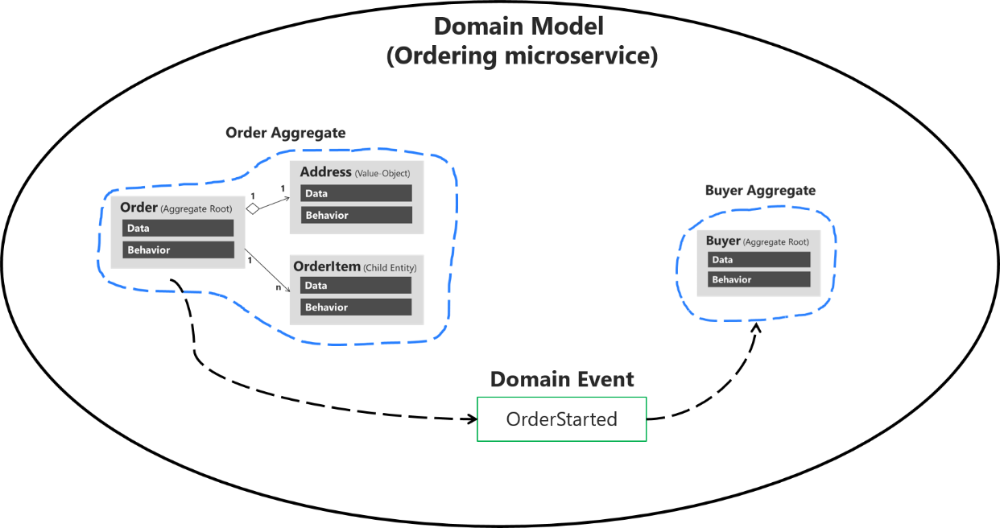

# Events

_Events_ indicate significant occurrences that have occurred in the domain and need to be reported to other stakeholders belonging to the domain. It is common for _Aggregates_ to publish events.

See Evolving Event in Distributed Systems for a deeper look at how eventing is handled in this project.

## Service communication

```
The Lambda Pinball is a Serverless anti-pattern highlighted by ThoughtWorks, in which “we lose sight of important domain logic in the tangled web of lambdas, buckets and queues as requests bounce around increasingly complex graphs of cloud services.”

This is often the result of a lack of clear Service boundaries. Moving to an EDA and adopting EventBridge can help massively — but this is not a standalone silver bullet.

What is needed is a focus on Services, identifying clear Bounded Contexts (to borrow from Domain-Driven Design) and sharing Event Schemas, not code, API interfaces or Data.
```

See: https://medium.com/serverless-transformation/eventbridge-storming-how-to-build-state-of-the-art-event-driven-serverless-architectures-e07270d4dee

## Why events?

**Events are the result of operations**, typically done by “[aggregate](https://martinfowler.com/bliki/DDD\_Aggregate.html)” systems. In common parlance, an _aggregate_ is often the system that is the “owner” of certain data, objects, or entities.

Splitting an over-sized “Member” model into multiple aggregates and seeing how they are represented in their various bounded contexts. From: [https://www.jamesmichaelhickey.com/domain-driven-design-aggregates/](https://www.jamesmichaelhickey.com/domain-driven-design-aggregates/)

At a high level, events and event-driven architecture means that we can—and should—decouple systems from each other. This enables us to practically build and sustain an intentional architecture, as promoted by Domain Driven Design, Clean Architecture and most serious software engineering principles today.

Ultimately, using event driven architecture optimises our IT landscape for decoupled data consumption, which is a cornerstone in modern cloud-based software development. This advice aligns with our 4th and 10th [IT principles](https://polestarjira.atlassian.net/wiki/spaces/digitaloffice/pages/2784231698):

> 4\. Decouple master data from business capability providers
>
> 10\. Optimize for data consumption

See more at:

* [https://docs.microsoft.com/en-us/archive/msdn-magazine/2009/february/best-practice-an-introduction-to-domain-driven-design](https://docs.microsoft.com/en-us/archive/msdn-magazine/2009/february/best-practice-an-introduction-to-domain-driven-design)
* [https://martinfowler.com/bliki/DomainDrivenDesign.html](https://martinfowler.com/bliki/DomainDrivenDesign.html)
* [https://en.wikipedia.org/wiki/Domain-driven\_design](https://en.wikipedia.org/wiki/Domain-driven\_design)
* [https://www.infoq.com/articles/ddd-in-practice/](https://www.infoq.com/articles/ddd-in-practice/)
* [https://blog.cleancoder.com/uncle-bob/2012/08/13/the-clean-architecture.html](https://blog.cleancoder.com/uncle-bob/2012/08/13/the-clean-architecture.html)
* [https://betterprogramming.pub/the-clean-architecture-beginners-guide-e4b7058c1165](https://betterprogramming.pub/the-clean-architecture-beginners-guide-e4b7058c1165)

### Events are APIs and have contracts too

Events are "first class citizens", similar to requests and responses in a REST API world.

Events are—in practice—APIs. They drive transactions and make commands to systems in a distributed landscape. Therefore we should use similar hygiene around them as with any generic REST API (or other similar construct), using standardized schemas and envelopes, enabling event discovery, ensuring testability and all other concerns that we have in distributed systems.

## Domain events

Domain events exist to inform of something happening inside of our Domain. These events do not leak to other Domains, nor are they exposed directly. This is the primary mechanism with which most of our custom-built systems will communicate. Using this concept, we can make available any event to all parties in the Domain, decoupling us maximally from each other.

See the diagrams below from [Microsoft](https://docs.microsoft.com/en-us/dotnet/architecture/microservices/microservice-ddd-cqrs-patterns/domain-events-design-implementation) for visual clarification:



.png>)

As seen in the diagrams, a typical domain event could be `OrderStarted` if we are in a commercial domain. This event would be sent to our domain’s event bus which all systems in scope of our domain may subscribe to.

### Naming, exactness and uniqueness of an event <a href="#naming-exactness-and-uniqueness-of-an-event" id="naming-exactness-and-uniqueness-of-an-event"></a>

Domain events should translate into clearly named and partitioned and non-overlapping names. Names are, as implied, domain-based and must use nomenclature and language that people understand in the particular domain. Key goals for us include:

* Removing **semantic ambiguity** (not understanding what something refers to)
* Removing **terminological contention** (many contexts claiming the same terms)
* Increasing and enforcing **domain language** (using the same terms that our domain stakeholders use and express)

Domain nomenclature is ultimately _only valid and meaningful within the domain_. Therefore, as a logical consequence, we should not spend time synchronizing nomenclature _across_ domains.

**Bad name example**

* `OrderUpdated`
* `ErrorOccurred`

**Why?**

Too broad term; very inspecific; easy to see that others may make claims to the same name; unclear what was actually done. “Order” may not be technically incorrect, but it’s also a term that might be highly contested or have other meanings when traveling across domains. A generic “Error” is not helpful.

**Good name examples**

* `SalesOrderDeliveryFieldChanged`
* `ManufacturingOrderDispatched`

**Why?**

Very clear demarcation on this being a “sales order” (not a _broad inspecific_ “order”); also communicates what exactly was changed.

`SalesOrder` would be a better example than `OrderUpdated` also because (we can assume in this fictional case) our system (or aggregate) controls and enforces this particular type of order.

Note that such work around naming is often more art than science.

### Use only Commands, Queries and Notifications for events <a href="#use-only-commands-queries-and-notifications-for-events" id="use-only-commands-queries-and-notifications-for-events"></a>

This principle also relates very much to other types of API.

We must separate our events (and ideally also API calls) into either the category of Command, Query or Notification, in line with how the [command-query separation](https://en.wikipedia.org/wiki/Command%E2%80%93query\_separation) concept and event notifications work:

> It states that every method should either be a **command** that performs an action, or a **query** that returns data to the caller, but not both. In other words, asking a question should not change the answer. More formally, methods should return a value only if they are referentially transparent and hence possess no side effects.

A Command in the context of events could be `RemoveStockItem`.

An example of a Query event would be `GetStockStateForItem`. You may recognize this from how even a classic REST API would work, though in that case using an endpoint. Because events are asynchronous, the system design for reading back data through events is by default somewhat complicated, as another surface to do the reading must be introduced. This is to say that _the event itself will not carry back the data_, instead the event will produce (for example) an update in the related data store that may be read back consistently.

This pattern may evolve into full-blown CQRS. See more at [https://docs.microsoft.com/en-us/azure/architecture/patterns/cqrs](https://docs.microsoft.com/en-us/azure/architecture/patterns/cqrs)

On top of _Commands_ and _Queries_ we have _Notifications_, which is what most people will understood events to be about. A notification is the conceptually simplest one, as it only represents that something happened, think `StockItemRemoved`.


Only aggregates must emit events since they enforce business rules. In practice this should be done post-fact as a result of an operation, for example like:

1. User makes a request to our system/service (“aggregate”)
2. Our system instantiates a class for our aggregate and fulfils the operation (if valid)
3. Our system emits an event to notify that the operation has occurred

From [https://stackoverflow.com/questions/67307449/ddd-handle-domain-events-directly-in-aggregate/67309855#67309855](https://stackoverflow.com/questions/67307449/ddd-handle-domain-events-directly-in-aggregate/67309855#67309855):

> An aggregate has the responsibility of maintaining the [invariants](https://domaincentric.net/blog/modelling-business-rules-invariants-vs-corrective-policies) required by the business logic (e.g. limits on how many pallets are in a given location or a prohibition on pallets containing certain items from being placed in a given location).
>
> However, a domain event represents a fact about the world which the aggregate cannot deny (an aggregate could ignore events if they have no meaning to it (which is not a question of validation, but of the type of event: the aggregate's current state cannot enter into it)). If an aggregate handles domain events, it therefore should do so unconditionally: if the business rule the location aggregate enforces is that there cannot be more than 20 pallets in a location, then a domain event which effectively leads to there being 20 thousand pallets in a location means that you have 20 thousand pallets in that location.

See:

* [https://www.jamesmichaelhickey.com/domain-driven-design-aggregates/](https://www.jamesmichaelhickey.com/domain-driven-design-aggregates/)
* [https://martinfowler.com/bliki/DDD\_Aggregate.html](https://martinfowler.com/bliki/DDD\_Aggregate.html)
* [https://www.alibabacloud.com/blog/an-in-depth-understanding-of-aggregation-in-domain-driven-design\_598034](https://www.alibabacloud.com/blog/an-in-depth-understanding-of-aggregation-in-domain-driven-design\_598034)
* [https://softwareengineering.stackexchange.com/questions/368358/can-an-aggregate-only-ever-consume-commands-and-produce-events](https://softwareengineering.stackexchange.com/questions/368358/can-an-aggregate-only-ever-consume-commands-and-produce-events)

## Persisting events

TODO: CQRS, Event Sourcing

Before emitting our events, we can store them in our DynamoDB table.

## Resiliency

The code base uses a trivial handwavy way to set up a Dead Letter Queue (often just abbreviated as DLQ). A full implementation would for example implement a Lambda function that just re-emits the event on the appropriate bus. This could theoretically become mined territory since we want to keep a tight ship regarding who can emit what event to which bus. In this case we can only use a single Lambda to do that work and it must not contain any business functionality—only re-emit the exact same event!

Further, note that there are differences for DLQs based on which service you are setting them up for, i.e. a Lambda DLQ will be useful when a Lambda function does not respond, but you will still need a separate EventBridge DLQ to guard against failures when a system tries to put something on the EventBridge bus.&#x20;

This is left to you as an optional exercise should you want to do this.

See:

* [https://serverlessland.com/blog/building-resilient-serverless-patterns-by-combining-messaging-services--aws-compute-blog](https://serverlessland.com/blog/building-resilient-serverless-patterns-by-combining-messaging-services--aws-compute-blog)
* [https://aws.amazon.com/blogs/compute/improved-failure-recovery-for-amazon-eventbridge/](https://aws.amazon.com/blogs/compute/improved-failure-recovery-for-amazon-eventbridge/)
* [https://www.youtube.com/watch?v=I6cXfiMkh-U](https://www.youtube.com/watch?v=I6cXfiMkh-U)
* [https://docs.aws.amazon.com/AWSCloudFormation/latest/UserGuide/aws-resource-sqs-queue.html#cfn-sqs-queue-queuename](https://docs.aws.amazon.com/AWSCloudFormation/latest/UserGuide/aws-resource-sqs-queue.html#cfn-sqs-queue-queuename)
* [https://www.serverless.com/framework/docs/providers/aws/events/event-bridge](https://www.serverless.com/framework/docs/providers/aws/events/event-bridge)
* [https://aws.amazon.com/blogs/compute/designing-durable-serverless-apps-with-dlqs-for-amazon-sns-amazon-sqs-aws-lambda/](https://aws.amazon.com/blogs/compute/designing-durable-serverless-apps-with-dlqs-for-amazon-sns-amazon-sqs-aws-lambda/)

## Practice

## Emitting events

The way we are addressing the events and eventing infrastructure follows this model:

`EventEmitter` -> `EmittableEvent` -> `Event`

&#x20;Let's see it in action:


```typescript
import { EventBridgeClient, PutEventsCommand } from '@aws-sdk/client-eventbridge';

import { EventBridgeEvent } from '../../interfaces/Event';
import { EventEmitter } from '../../interfaces/EventEmitter';

import { MissingEnvVarsError } from '../../application/errors/MissingEnvVarsError';

/**
 * @description Factory function to return freshly minted EventBridge instance.
 */
export const makeNewEventBridgeEmitter = (region: string) => {
  if (!region) throw new MissingEnvVarsError(JSON.stringify([{ key: 'REGION', value: region }]));

  return new EventBridgeEmitter(region);
};

/**
 * @description An EventBridge implementation of the `EventEmitter`.
 */
class EventBridgeEmitter implements EventEmitter {
  eventBridge: any;

  constructor(region: string) {
    this.eventBridge = new EventBridgeClient({ region });
  }

  /**
   * @description Utility to emit events with the AWS EventBridge library.
   *
   * @see https://docs.aws.amazon.com/eventbridge/latest/APIReference/API_PutEvents.html
   * @see https://www.npmjs.com/package/@aws-sdk/client-eventbridge
   */
  public async emit(event: EventBridgeEvent): Promise<void> {
    const command = new PutEventsCommand({ Entries: [event] });
    if (process.env.NODE_ENV === 'test') return;
    await this.eventBridge.send(command);
  }
}
```


We see that there is a basic Factory there, and then the `EventBridgeEmitter` just implements the overall `EventEmitter` which is just a simple interface so we can create other emitter infrastructure in the future. We want to separate the emitters primarily for testing (and local development) reasons, so that we can use a local mock rather than the full-blown EventBridge client.

## The events

The `EmittableEvent` value object might look long and daunting, but it's actually very simple. The  situation we have to deal with is that the event shape is rather deep meaning it does take some energy to construct it.


```typescript
import { randomUUID } from 'crypto';

import {
  EventInput,
  EventDetail,
  EventBridgeEvent,
  EventDTO,
  MakeEventInput,
  MetadataInput
} from '../../interfaces/Event';
import { Metadata, MetadataConfigInput } from '../../interfaces/Metadata';

import { getCorrelationId } from '../../infrastructure/utils/userMetadata';

import { MissingMetadataFieldsError } from '../../application/errors/MissingMetadataFieldsError';
import { NoMatchInEventCatalogError } from '../../application/errors/NoMatchInEventCatalogError';

/**
 * @description Vend a "Event Carried State Transfer" type event with state
 * that can be emitted with an emitter implementation.
 */
abstract class EmittableEvent {
  event: EventBridgeEvent;
  eventBusName: string;
  metadataConfig: MetadataConfigInput;

  constructor(eventInput: EventInput) {
    const { event, eventBusName, metadataConfig } = eventInput;
    this.eventBusName = eventBusName;
    this.metadataConfig = metadataConfig;

    const eventDTO: EventDTO = this.makeDTO(event);
    this.event = this.make(eventDTO);
  }

  /**
   * @description Make an intermediate Data Transfer Object that
   * contains all required information to vend out a full event.
   */
  private makeDTO(eventInput: MakeEventInput): EventDTO {
    const { eventName, slotId, slotStatus } = eventInput;

    const detailType = this.matchDetailType(eventName);

    return {
      eventBusName: this.eventBusName,
      eventName,
      detailType,
      // @ts-ignore
      metadata: {
        ...this.metadataConfig,
        version: eventInput.version || 1,
        id: randomUUID().toString(),
        correlationId: getCorrelationId()
      },
      data: {
        event: eventName,
        slotId,
        slotStatus,
        hostName: eventInput.hostName || '',
        startTime: eventInput.startTime || ''
      }
    };
  }

  /**
   * @description Produces a fully formed event that can be used with AWS EventBridge.
   */
  private make(eventDto: EventDTO): EventBridgeEvent {
    const { eventBusName, data, metadata, detailType } = eventDto;
    const { version, id, correlationId } = metadata;
    const source = `${metadata.domain?.toLowerCase()}.${metadata.system?.toLowerCase()}.${detailType.toLowerCase()}`;

    const detail: EventDetail = {
      metadata: this.produceMetadata({ version, id, correlationId }),
      data
    };

    return {
      EventBusName: eventBusName,
      Source: source,
      DetailType: detailType,
      Detail: JSON.stringify(detail)
    };
  }

  /**
   * @description Produce correct metadata format for the event.
   * @note The verbose format is used as we cannot make assumptions
   * on users actually passing in fully formed data.
   */
  private produceMetadata(metadataInput: MetadataInput): Metadata {
    const { version, id, correlationId } = metadataInput;

    if (
      !version ||
      !this.metadataConfig.lifecycleStage ||
      !this.metadataConfig.domain ||
      !this.metadataConfig.system ||
      !this.metadataConfig.service ||
      !this.metadataConfig.team
    )
      throw new MissingMetadataFieldsError(metadataInput);

    const timeNow = Date.now();

    return {
      timestamp: new Date(timeNow).toISOString(),
      timestampEpoch: `${timeNow}`,
      id,
      correlationId,
      version,
      lifecycleStage: this.metadataConfig.lifecycleStage,
      domain: this.metadataConfig.domain,
      system: this.metadataConfig.system,
      service: this.metadataConfig.service,
      team: this.metadataConfig.team,
      platform: this.metadataConfig.platform,
      owner: this.metadataConfig.owner,
      region: this.metadataConfig.region,
      jurisdiction: this.metadataConfig.jurisdiction,
      tags: this.metadataConfig.tags,
      dataSensitivity: this.metadataConfig.dataSensitivity
    };
  }

  /**
   * @description Pick out matching `detail-type` field from event names.
   * @note Should be refactored to regex solution if this grows.
   */
  private matchDetailType(eventName: string) {
    switch (eventName) {
      case 'CREATED':
        return 'Created';
      case 'CANCELLED':
        return 'Cancelled';
      case 'RESERVED':
        return 'Reserved';
      case 'CHECKED_IN':
        return 'CheckedIn';
      case 'CHECKED_OUT':
        return 'CheckedOut';
      case 'UNATTENDED':
        return 'Unattended';
    }

    throw new NoMatchInEventCatalogError(eventName);
  }

  /**
   * @description Get event payload.
   */
  public get() {
    return this.event;
  }

  /**
   * @description Return modified DTO variant for analytics purposes.
   * Use "Notification" type event without state.
   */
  public getAnalyticsVariant(analyticsBusName: string): EventBridgeEvent {
    const analyticsEvent = JSON.parse(JSON.stringify(this.get()));
    const detail = JSON.parse(analyticsEvent.Detail);

    analyticsEvent['EventBusName'] = analyticsBusName;
    detail['metadata']['id'] = randomUUID().toString();
    if (detail.data?.slotStatus) delete detail['data']['slotStatus'];

    analyticsEvent['Detail'] = JSON.stringify(detail);

    return analyticsEvent as EventBridgeEvent;
  }
}

/**
 * @description An event that represents the `Created` invariant state.
 */
export class CreatedEvent extends EmittableEvent {
  //
}

/**
 * @description An event that represents the `Cancelled` invariant state.
 */
export class CancelledEvent extends EmittableEvent {
  //
}

/**
 * @description An event that represents the `Reserved` invariant state.
 */
export class ReservedEvent extends EmittableEvent {
  //
}

/**
 * @description An event that represents the `CheckedIn` invariant state.
 */
export class CheckedInEvent extends EmittableEvent {
  //
}

/**
 * @description An event that represents the `CheckedOut` invariant state.
 */
export class CheckedOutEvent extends EmittableEvent {
  //
}

/**
 * @description An event that represents the `Unattended` invariant state.
 */
export class UnattendedEvent extends EmittableEvent {
  //
}
```


Admittedly the event structure (despite our decoupling of the emitter itself) is tied to EventBridge that is acceptable as we are actually only using EventBridge in our project. If we would support truly different emitters we would perhaps need to add further abstractions on the event shape. In the context of this project we can accept that as a trivia item.

### Metadata

The `produceMetadata` method does what it says on the box. It's not that complicated but allows us the possibility to vend a metadata object that is always as expected.

### Matching the detail type

Very basic, dumb implementation to match the event name to a recased version.

### DTO

First we make the EventDTO. This has the overall shape we actually require.

### Make method

The `make()` method takes our event DTO and forms it into the EventBridgeEvent that can actually be put on our event bus.

### Get method

In order to use the class (remember, data _and_ behavior!) rather than a dumb plain object, we'll allow a method to access the current representation.

### Get analytics method

Just as the regular `get()` method, the `getAnalyticsVariant()` method returns a representation of the event. The reasons we want to have this as a specific method is:

* The analytics event bus is not the same as the regular one
* We want to redact the (potentially sensitive) ID
* The analytics context does not need the slot status

### Extended classes

There is nothing unique concerning the classes that we should use, so we can contain the "base" class and make trivial extensions to allow use for the derived classes instead.
