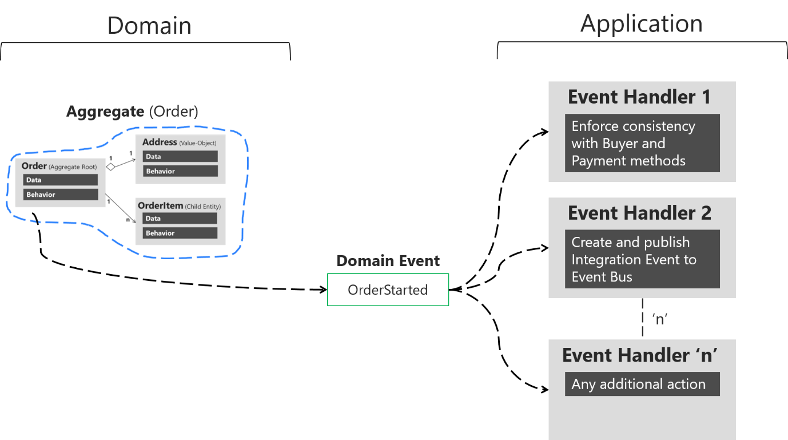

# Events

<figure><figcaption><p>Illustration from <a href="https://undraw.co/">Undraw</a></p></figcaption></figure>


**TL;DR**

When we say **Events** we in practice always refer to Domain Events. They are a way of decoupling parts of your solution or landscape while expressing what is going on in the terms of ubiquitous language. **Events** can be used with any technology and DDD has no opinion on that side of things.


<figure><figcaption><p>(Domain) Events reside in the Domain layer.</p></figcaption></figure>

_Domain Events_ indicate **significant occurrences that have occurred in the domain** and need to be reported to other stakeholders belonging to the domain. Aggregates are responsible for publishing events, though we saw how in our example project it is the Domain Service wrapping the `Entity` that actually does that work for reasons mentioned in that section. Domain Events drive transactions and can make commands to other systems.

At a high level, events and event-driven architecture mean that we can—and should—decouple systems from each other. This enables us to practically build and sustain an intentional architecture, as promoted by Domain Driven Design, Clean Architecture, and most serious software engineering principles today.

See the diagrams below from [Microsoft](https://docs.microsoft.com/en-us/dotnet/architecture/microservices/microservice-ddd-cqrs-patterns/domain-events-design-implementation) for visual clarification:




As seen in the diagrams, a typical domain event could be `OrderStarted` if we are in a commercial domain. This event would be sent to our domain’s event bus which all systems in the scope of our domain may subscribe to.


See more at:

- [https://docs.microsoft.com/en-us/archive/msdn-magazine/2009/february/best-practice-an-introduction-to-domain-driven-design](https://docs.microsoft.com/en-us/archive/msdn-magazine/2009/february/best-practice-an-introduction-to-domain-driven-design)
- [https://martinfowler.com/bliki/DomainDrivenDesign.html](https://martinfowler.com/bliki/DomainDrivenDesign.html)
- [https://en.wikipedia.org/wiki/Domain-driven_design](https://en.wikipedia.org/wiki/Domain-driven_design)
- [https://www.infoq.com/articles/ddd-in-practice/](https://www.infoq.com/articles/ddd-in-practice/)
- [https://blog.cleancoder.com/uncle-bob/2012/08/13/the-clean-architecture.html](https://blog.cleancoder.com/uncle-bob/2012/08/13/the-clean-architecture.html)
- [https://betterprogramming.pub/the-clean-architecture-beginners-guide-e4b7058c1165](https://betterprogramming.pub/the-clean-architecture-beginners-guide-e4b7058c1165)
  

## Naming, exactness and uniqueness of an event <a href="#naming-exactness-and-uniqueness-of-an-event" id="naming-exactness-and-uniqueness-of-an-event"></a>

Domain events should translate into clearly named and partitioned and non-overlapping names. Names are, as implied, domain-based and must use nomenclature and language that people understand in the particular domain. Key goals for us include:

- Removing **semantic ambiguity** (not understanding what something refers to)
- Removing **terminological contention** (many contexts claiming the same terms)
- Increasing and enforcing **domain language** (using the same terms that our domain stakeholders use and express)

Domain nomenclature is ultimately _only valid and meaningful within the domain_. Therefore, as a logical consequence, we should not spend time synchronizing nomenclature _across_ domains.

**Bad name example**

- `OrderUpdated`
- `ErrorOccurred`

**Why?**

Too broad term; very inspecific; easy to see that others may make claims to the same name; unclear what was actually done. “Order” may not be technically incorrect, but it’s also a term that might be highly contested or have other meanings when traveling across domains. A generic “Error” is not helpful.

**Good name examples**

- `SalesOrderDeliveryFieldChanged`
- `ManufacturingOrderDispatched`

**Why?**

Very clear demarcation on this being a “sales order” (not a _broad inspecific_ “order”); also communicates what exactly was changed.

`SalesOrder` would be a better example than `OrderUpdated` also because (we can assume in this fictional case) our system (or Aggregate) controls and enforces this particular type of order.

Note that such work around naming is often more art than science.

## Persisting events

It's wise to store a history of all events that have occurred. This makes it possible to "play back" the history of a system—well, Aggregate to be exact—and is a foundational component of the [CQRS (Command Query Responsibility Segregation) pattern](https://learn.microsoft.com/en-us/azure/architecture/patterns/cqrs).

Personally, I find full-on CQRS to be _a lot_ to deal with, and modern cloud architectures can mitigate and improve some of the conditions from which original CQRS evolved. I would however highly advise you to:

- Use [CQS (Command Query Separation)](https://martinfowler.com/bliki/CommandQuerySeparation.html) when naming. This forms the philosophical underpinning of CQRS itself, meaning that you create a very crisp and elegant nomenclature around events themselves. CQS "weighs" nothing and everyone wins.
- Use an event store to persist all events when you emit Domain Events.

The solution used here is manual and is done completely in code, on behalf of the Domain Service (that stands in for the Aggregate orchestration), doing this type of transactional dance (in the case of the Reservation solution)

- Update the Slot table with the updated item
- Update the Slot table with the event
- Emit the Domain Event


AWS natives will maybe point to a more elegant solution using DynamoDB streams as an outbox pattern, which could definitely work. I am 50/50 which I like the most because doing so would mean you still have to implement some mechanism like a Lambda that can "translate" the DynamoDB table item changes into actual Domain Events.


## Resiliency

The code base uses a trivial handwavy way to set up a Dead Letter Queue (often just abbreviated as DLQ). A full implementation would for example implement a Lambda function that just re-emits the event on the appropriate bus. This could theoretically become mined territory since we want to keep a tight ship regarding who can emit what event to which bus. In this case, we can only use a single Lambda to do that work and it must not contain any business functionality—only re-emit the exact same event!

Further, note that there are differences for DLQs based on which service you are setting them up for, i.e. a Lambda DLQ will be useful when a Lambda function does not respond, but you will still need a separate EventBridge DLQ to guard against failures when a system tries to put something on the EventBridge bus.&#x20;

This is left to you as an optional exercise should you want to do this.


See the following for more information:

- [https://serverlessland.com/blog/building-resilient-serverless-patterns-by-combining-messaging-services--aws-compute-blog](https://serverlessland.com/blog/building-resilient-serverless-patterns-by-combining-messaging-services--aws-compute-blog)
- [https://aws.amazon.com/blogs/compute/improved-failure-recovery-for-amazon-eventbridge/](https://aws.amazon.com/blogs/compute/improved-failure-recovery-for-amazon-eventbridge/)
- [https://www.youtube.com/watch?v=I6cXfiMkh-U](https://www.youtube.com/watch?v=I6cXfiMkh-U)
- [https://docs.aws.amazon.com/AWSCloudFormation/latest/UserGuide/aws-resource-sqs-queue.html#cfn-sqs-queue-queuename](https://docs.aws.amazon.com/AWSCloudFormation/latest/UserGuide/aws-resource-sqs-queue.html#cfn-sqs-queue-queuename)
- [https://aws.amazon.com/blogs/compute/designing-durable-serverless-apps-with-dlqs-for-amazon-sns-amazon-sqs-aws-lambda/](https://aws.amazon.com/blogs/compute/designing-durable-serverless-apps-with-dlqs-for-amazon-sns-amazon-sqs-aws-lambda/)
  

## Emitting events

At this point, it should be relatively clear that Domain Events are important and that they should be named well and persisted. But what are they?

In the example project, we use AWS EventBridge, which similarly to other such services, takes in an object as the event payload. There's more to it, but more or less you'll get to stick in whatever object you want (with some size restrictions, etc.).

To work with Domain Events in a controlled manner we'll however need more than just an odd JSON blob.

Our project uses:

- The `SlotCommand` output from the Slot Entity, which dictates the majority of actual content coming from changes.
- `EventEmitter` abstraction that does the infrastructural work. This has both a "local/mock" and an EventBridge implementation.
- A `DomainEventPublisher` Application Service that wraps the event emitter (which will emit two events—one for actual use and one for the analytics service—and log out the event).
- An `EmittableEvent` abstraction class that handles all the logic of producing the right shape and metadata and other such laborious things.
- A range of Events (one for each Domain Event) that extends the `EmittableEvent`.


A Domain Event is therefore always constructed from a `SlotCommand`. The `DomainEventPublisher` is the Application Service that is injected into `ReservationService`.


### The event emitter



```typescript
import {
  EventBridgeClient,
  PutEventsCommand,
} from "@aws-sdk/client-eventbridge";

import { EventBridgeEvent } from "../../interfaces/Event";
import { EventEmitter } from "../../interfaces/EventEmitter";

import { MissingEnvVarsError } from "../../application/errors/MissingEnvVarsError";

/**
 * @description Factory function to return freshly minted EventBridge instance.
 */
export const createEventBridgeEmitter = (region: string) => {
  if (!region)
    throw new MissingEnvVarsError(
      JSON.stringify([{ key: "REGION", value: region }])
    );

  return new EventBridgeEmitter(region);
};

/**
 * @description An EventBridge implementation of the `EventEmitter`.
 */
class EventBridgeEmitter implements EventEmitter {
  private readonly eventBridge: EventBridgeClient;

  constructor(region: string) {
    this.eventBridge = new EventBridgeClient({ region });
  }

  /**
   * @description Utility to emit events with the AWS EventBridge library.
   *
   * @see https://docs.aws.amazon.com/eventbridge/latest/APIReference/API_PutEvents.html
   * @see https://www.npmjs.com/package/@aws-sdk/client-eventbridge
   */
  public async emit(event: EventBridgeEvent): Promise<void> {
    const command = new PutEventsCommand({ Entries: [event] });
    if (process.env.NODE_ENV !== "test") await this.eventBridge.send(command);
  }
}
```



We see that there is a basic Factory there, and then the `EventBridgeEmitter` just implements the overall `EventEmitter` which is just a simple interface so we can create other emitter infrastructure in the future. We want to separate the emitters primarily for testing (and local development) reasons so that we can use a local mock rather than the full-blown EventBridge client.

### Domain event publisher service



```typescript
import { MikroLog } from "mikrolog";

import { Event } from "../../interfaces/Event";
import {
  DomainEventPublisherDependencies,
  DomainEventPublisherService,
} from "../../interfaces/DomainEventPublisherService";
import { EventEmitter } from "../../interfaces/EventEmitter";

import { MissingDependenciesError } from "../errors/MissingDependenciesError";
import { MissingEnvVarsError } from "../errors/MissingEnvVarsError";

/**
 * @description Factory function to set up the `DomainEventPublisherService`.
 */
export function createDomainEventPublisherService(
  dependencies: DomainEventPublisherDependencies
) {
  return new ConcreteDomainEventPublisherService(dependencies);
}

/**
 * @description Service to publish domain events.
 */
class ConcreteDomainEventPublisherService
  implements DomainEventPublisherService
{
  private readonly eventEmitter: EventEmitter;
  private readonly analyticsBusName: string;
  private readonly domainBusName: string;
  private readonly logger: MikroLog;

  constructor(dependencies: DomainEventPublisherDependencies) {
    if (!dependencies.eventEmitter) throw new MissingDependenciesError();
    const { eventEmitter } = dependencies;

    this.eventEmitter = eventEmitter;
    this.logger = MikroLog.start();

    this.analyticsBusName = process.env.ANALYTICS_BUS_NAME || "";
    this.domainBusName = process.env.DOMAIN_BUS_NAME || "";

    if (!this.analyticsBusName || !this.domainBusName)
      throw new MissingEnvVarsError(
        JSON.stringify([
          { key: "DOMAIN_BUS_NAME", value: process.env.DOMAIN_BUS_NAME },
          { key: "ANALYTICS_BUS_NAME", value: process.env.ANALYTICS_BUS_NAME },
        ])
      );
  }

  /**
   * @description Convenience method to emit an event
   * to the domain bus and to the analytics bus.
   */
  public async publish(event: Event): Promise<void> {
    const source = event.get().Source;

    await this.eventEmitter.emit(event.get());
    this.logger.log(`Emitted '${source}' to '${this.domainBusName}'`);

    await this.eventEmitter.emit(
      event.getAnalyticsVariant(this.analyticsBusName)
    );
    this.logger.log(`Emitted '${source}' to '${this.analyticsBusName}'`);
  }
}
```



As written previously, this one adds a layer of extra spice with the multiple emitted events and logging. Other than that it's not much else under the hood. At least it makes it much easier and one step more removed from the real infrastructure.

## The events

The `EmittableEvent` Value Object might look long and daunting, but it's actually very simple. The situation we have to deal with is that the event shape is rather deep meaning it does take some energy to construct it.



```typescript
import { randomUUID } from "crypto";

import {
  EventInput,
  EventDetail,
  EventBridgeEvent,
  EventDTO,
  MakeEventInput,
  MetadataInput,
} from "../../interfaces/Event";
import { Metadata, MetadataConfigInput } from "../../interfaces/Metadata";

import { getCorrelationId } from "../../infrastructure/utils/userMetadata";

import { MissingMetadataFieldsError } from "../../application/errors/MissingMetadataFieldsError";
import { NoMatchInEventCatalogError } from "../../application/errors/NoMatchInEventCatalogError";
import { MissingEnvVarsError } from "../../application/errors/MissingEnvVarsError";

/**
 * @description Vend a "Event Carried State Transfer" type event with state
 * that can be emitted with an emitter implementation.
 */
abstract class EmittableEvent {
  private readonly event: EventBridgeEvent;
  private readonly eventBusName: string;
  private readonly metadataConfig: MetadataConfigInput;

  constructor(eventInput: EventInput) {
    const { event, metadataConfig } = eventInput;
    this.eventBusName = process.env.DOMAIN_BUS_NAME || "";
    this.metadataConfig = metadataConfig;

    if (!this.eventBusName)
      throw new MissingEnvVarsError(
        JSON.stringify([
          { key: "DOMAIN_BUS_NAME", value: process.env.DOMAIN_BUS_NAME },
        ])
      );

    const eventDTO = this.toDto(event);
    this.event = this.make(eventDTO);
  }

  /**
   * @description Make an intermediate Data Transfer Object that
   * contains all required information to vend out a full event.
   */
  private toDto(eventInput: MakeEventInput): EventDTO {
    const { eventName, slotId, slotStatus } = eventInput;

    const detailType = this.matchDetailType(eventName);
    const timeNow = Date.now();

    return {
      eventBusName: this.eventBusName,
      eventName,
      detailType,
      metadata: {
        ...this.metadataConfig,
        version: eventInput.version || 1,
        id: randomUUID().toString(),
        correlationId: getCorrelationId(),
        timestamp: new Date(timeNow).toISOString(),
        timestampEpoch: `${timeNow}`,
      },
      data: {
        event: eventName,
        slotId,
        slotStatus,
        hostName: eventInput.hostName || "",
        startTime: eventInput.startTime || "",
      },
    };
  }

  /**
   * @description Produces a fully formed event that can be used with AWS EventBridge.
   */
  private make(eventDto: EventDTO): EventBridgeEvent {
    const { eventBusName, data, metadata, detailType } = eventDto;
    const { version, id, correlationId } = metadata;
    const source = `${metadata.domain?.toLowerCase()}.${metadata.system?.toLowerCase()}.${detailType.toLowerCase()}`;

    const detail: EventDetail = {
      metadata: this.produceMetadata({ version, id, correlationId }),
      data,
    };

    return {
      EventBusName: eventBusName,
      Source: source,
      DetailType: detailType,
      Detail: JSON.stringify(detail),
    };
  }

  /**
   * @description Produce correct metadata format for the event.
   * @note The verbose format is used as we cannot make assumptions
   * on users actually passing in fully formed data.
   */
  private produceMetadata(metadataInput: MetadataInput): Metadata {
    const { version, id, correlationId } = metadataInput;

    if (
      !version ||
      !this.metadataConfig.lifecycleStage ||
      !this.metadataConfig.domain ||
      !this.metadataConfig.system ||
      !this.metadataConfig.service ||
      !this.metadataConfig.team
    )
      throw new MissingMetadataFieldsError(metadataInput);

    const timeNow = Date.now();

    return {
      timestamp: new Date(timeNow).toISOString(),
      timestampEpoch: `${timeNow}`,
      id,
      correlationId,
      version,
      lifecycleStage: this.metadataConfig.lifecycleStage,
      domain: this.metadataConfig.domain,
      system: this.metadataConfig.system,
      service: this.metadataConfig.service,
      team: this.metadataConfig.team,
      hostPlatform: this.metadataConfig.hostPlatform,
      owner: this.metadataConfig.owner,
      region: this.metadataConfig.region,
      jurisdiction: this.metadataConfig.jurisdiction,
      tags: this.metadataConfig.tags,
      dataSensitivity: this.metadataConfig.dataSensitivity,
    };
  }

  /**
   * @description Pick out matching `detail-type` field from event names.
   * @note Should be refactored to regex solution if this grows.
   */
  private matchDetailType(eventName: string) {
    switch (eventName) {
      // User interaction events
      case "CREATED":
        return "Created";
      case "CANCELLED":
        return "Cancelled";
      case "RESERVED":
        return "Reserved";
      case "CHECKED_IN":
        return "CheckedIn";
      case "CHECKED_OUT":
        return "CheckedOut";
      case "UNATTENDED":
        return "Unattended";
      // System interaction events
      case "OPENED":
        return "Opened";
      case "CLOSED":
        return "Closed";
    }

    throw new NoMatchInEventCatalogError(eventName);
  }

  /**
   * @description Get event payload.
   */
  public get() {
    return this.event;
  }

  /**
   * @description Return modified DTO variant for analytics purposes.
   * Use "Notification" type event without state.
   */
  public getAnalyticsVariant(analyticsBusName: string): EventBridgeEvent {
    const analyticsEvent: EventBridgeEvent = JSON.parse(
      JSON.stringify(this.get())
    );
    const detail = JSON.parse(analyticsEvent.Detail);

    analyticsEvent["EventBusName"] = analyticsBusName;
    detail["metadata"]["id"] = randomUUID().toString();
    if (detail.data?.slotStatus) delete detail["data"]["slotStatus"];

    analyticsEvent["Detail"] = JSON.stringify(detail);

    return analyticsEvent;
  }
}

/**
 * @description An event that represents the `Created` invariant state.
 */
export class CreatedEvent extends EmittableEvent {
  //
}

/**
 * @description An event that represents the `Cancelled` invariant state.
 */
export class CancelledEvent extends EmittableEvent {
  //
}

/**
 * @description An event that represents the `Reserved` invariant state.
 */
export class ReservedEvent extends EmittableEvent {
  //
}

/**
 * @description An event that represents the `CheckedIn` invariant state.
 */
export class CheckedInEvent extends EmittableEvent {
  //
}

/**
 * @description An event that represents the `CheckedOut` invariant state.
 */
export class CheckedOutEvent extends EmittableEvent {
  //
}

/**
 * @description An event that represents the `Unattended` invariant state.
 */
export class UnattendedEvent extends EmittableEvent {
  //
}

/**
 * @description An event that represents the `Open` invariant state.
 */
export class OpenedEvent extends EmittableEvent {
  //
}

/**
 * @description An event that represents the `Closed` invariant state.
 */
export class ClosedEvent extends EmittableEvent {
  //
}
```




Admittedly the event structure (despite our decoupling of the emitter itself) is tied to EventBridge which is acceptable as we are actually only using EventBridge in our project. If we would support truly different emitters we would perhaps need to add further abstractions on the event shape. In the context of this project, we can accept that as a trivia item.


### Metadata

The `produceMetadata` method does what it says on the box. It's not that complicated but allows us the possibility to vend a metadata object that is always as expected.

### Matching the detail type

Very basic, dumb implementation to match the event name to a recased version.

### DTO

First, we make the EventDTO. This has the overall shape we actually require.

### Make method

The `make()` method takes our event DTO and forms it into the EventBridgeEvent that can actually be put on our event bus.

### Get method

In order to use the class (remember, data _and_ behavior!) rather than a dumb plain object, we'll allow a method to access the current representation.

### Get analytics method

Just as the regular `get()` method, the `getAnalyticsVariant()` method returns a representation of the event. The reasons we want to have this as a specific method are:

- The analytics event bus is not the same as the regular one
- We want to redact the (potentially sensitive) ID
- The analytics context does not need the slot status

### Extended classes

There is nothing unique concerning the classes that we should use, so we can contain the "base" class and make trivial extensions to allow use for the derived classes instead.
